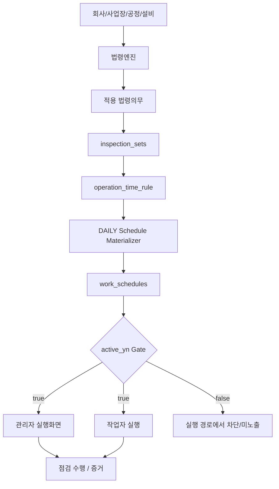

# TAI Safe 법정점검 DAILY Materialization 작업완료 보고서

**Stage1 Executability Gate → Stage2 Schedule Materializer → Stage3 Production Daily Trigger**

| 항목 | 값 |
|------|-----|
| 작성일 | 2026-09-13 |
| Repo | `taiengineering/tai-api` |
| 문서 성격 | Completion Record + Architecture Record + Operating Boundary + Handoff |
| 코드/DB/Railway 변경 | 이 문서 WO에서는 **0** |

---

## 1. Executive Summary

**TAI Safe의 법정점검 일정 자동생성 본선은 Stage1~Stage3까지 완료되었으며 Production Active 상태다.**

사용자·운영 관점에서는 다음과 같다.

법령엔진/운영주기에서 실제로 실행해야 할 점검일정이 결정되면, TAI가 **매일 자동으로** 이를 확인하여:

- 필요한 **최신 일정**을 생성하고
- 더 이상 유효하지 않은 **미래 일정을 비활성화**하고
- 안전하게 복구 가능한 **비활성 최신 일정은 다시 활성화**하고
- 실행하면 안 되는 일정은 **관리자/작업자 실행 경로에서 차단**한다.

Production automatic execution:

```text
매일 00:10 Asia/Seoul
```

| 단계 | 상태 |
|------|------|
| Stage1 Executability Gate | **CLOSED** |
| Stage2 DAILY Materializer | **CLOSED** · Production E2E **PASS** |
| Stage3 Physical Trigger | **CLOSED** · Daily cron **ACTIVE** |
| Duplicate automatic authority | **0** |

---

## 2. 전체 아키텍처

```text
회사 / 사업장 / 공정 / 설비 정보
            ↓
       법령엔진
            ↓
      적용 법령의무
            ↓
     inspection_sets
            ↓
 operation_time_rule (OTR)
            ↓
 ┌────────────────────────────┐
 │ DAILY Schedule Materializer│
 └────────────────────────────┘
            ↓
       work_schedules
            ↓
     active_yn Gate
       ↓           ↓
 관리자 실행화면   작업자 실행
       ↓           ↓
       점검 수행 / 증거
```



### 역할 구분 (CURRENT)

| 계층 | 역할 |
|------|------|
| **법령엔진** | *무엇을* 해야 하는가 (적용 의무) |
| **Operation Time Rule (OTR)** | *언제* 해야 하는가 |
| **DAILY Materializer** | 확정된 의무+OTR을 실제 `work_schedule` occurrence로 만든다 |
| **Executability Gate** | 그 occurrence를 *실제로 실행해도 되는가* (`active_yn`) |
| **Physical Trigger** | Materializer를 매일 자동 실행한다 |

Materializer는 **판단 엔진이 아니다.** 확정된 법령의무 + OTR을 실행 schedule로 materialize하는 엔진이다.

---

## 3. 핵심 설계 원칙

### 3.1 Lifecycle ≠ Executability

```text
status_code  ≠  active_yn
```

- `status_code` = lifecycle (`planned` / `scheduled` / `in_progress` / `completed` 등)
- `active_yn` = **실행 가능성 (executability)**

Executable consumer는 **`active_yn=true` hard gate**를 강제한다.
`status_code`만으로 “실행 가능”을 판정하지 않는다.

### 3.2 Occurrence identity

`work_schedules` occurrence는 단순 `id`만으로 다루지 않는다.

| Identity | 의미 |
|----------|------|
| `(id, factory_id)` | 모든 update의 exact occurrence pair |
| `(inspection_set_id, planned_date, factory_id)` | canonical schedule identity (latest / exact resolve) |

다른 factory sibling 승격, `inspection_set_id`-only UPDATE, active-first lookup으로 identity를 바꾸지 않는다.

### 3.3 Mutable current truth + history preserve

운영주기가 바뀌어도 **기존 schedule row를 삭제하거나 planned_date를 갈아끼우지 않는다.**

예시:

```text
기존 미래 일정 10/10
새 운영기준   10/15
```

처리:

```text
10/10 row = 물리 보존, active_yn=false
10/15     = 최신 schedule 생성/확보 (active_yn=true)
```

불변:

```text
physical DELETE = 0
planned_date rewrite = 0
```

### 3.4 Latest first (Stage2 safety invariant)

절대 순서:

```text
ENSURE EXPECTED_LATEST_EXECUTABLE
        ↓
VERIFY (exact LEGAL + active_yn=true)
        ↓
STALE INACTIVATE (eligible only)
```

금지 순서:

```text
STALE INACTIVATE → 그 다음에 latest 확보
```

latest 확보/검증 실패 시:

```text
stale mutation = 0
```

---

## 4. Stage1 — Executability Gate

| 항목 | 값 |
|------|-----|
| 상태 | **CLOSED** |
| `EXECUTABILITY_GATE_READY` | **PASS** |
| PR | tai-api **#320** |
| Merge commit | `0133043b4da1d41d6a259170f6b7860dd13d38d3` |

### 목적

`active_yn=false` occurrence가 다음 경로에서 **실행되지 못하게** 한다.

- 관리자 실행/일정 화면
- 작업자 today 경로
- notification
- start/submit 등 RPC

### 핵심

```text
consumer hard gate = active_yn = true
```

RPC도 inactive occurrence를 **fail-close**한다.
대표 error: `WORK_SCHEDULE_NOT_EXECUTABLE`

### Production E2E (요약)

| 검증 | 결과 |
|------|------|
| inactive · admin execution screen | hidden |
| inactive · worker today | hidden |
| inactive · notification | blocked |
| inactive · RPC start | rejected |
| side effect | 0 |

---

## 5. Stage2 — DAILY Schedule Materializer

| 항목 | 값 |
|------|-----|
| 상태 | **CLOSED** |
| `STAGE2_PRODUCTION_VERIFIED` | **PASS** |
| PR | tai-api **#318** |
| Squash merge | `64e677adba4df8f498a7d24506f5fea476570543` |

### 공식 authority (재사용 필수)

```python
# Orchestrator — factory loop + counters
services.inspection_sets_svc.schedules.generate_schedules_all()

# Materializer — OTR → work_schedules (Stage2 disposition)
services.inspection_sets_svc.law_engine.run_generate_operation_schedules()
```

새 factory scheduling loop / 별도 scheduler engine을 만들지 않는다.

---

## 6. Stage2 disposition 계약

최종 disposition:

```text
PRESERVE
+ INACTIVATE
+ INSERT
+ eligible REACTIVATE
```

### 6.1 INSERT

예상 latest identity가 없으면:

```text
새 schedule 생성
source_type = LEGAL
status_code = scheduled
active_yn = true
```

upsert 반환만 믿지 않고, exact identity를 **재조회**하여:

```text
source_type = LEGAL AND active_yn = true
```

를 확인한 뒤에만 latest secured로 본다.

### 6.2 REACTIVATE — `AUTO_REACTIVATABLE_EXACT`

exact latest가 이미 있으나 inactive인 경우, **아무 row나 살리지 않는다.**

다음을 **모두** 만족할 때만 `active_yn: false → true`:

```text
source_type = LEGAL
normalized lifecycle ∈ { planned, scheduled }
active_yn IS FALSE
child-free
is_excluded IS NOT TRUE
excluded_reason IS NULL
```

- 동일 occurrence identity 유지 (새 schedule ID 생성 금지)
- 필요 시 `assigned_user_id` only sync는 기존 계약대로 허용
- `planned_date` / `status_code` / `source_type` / identity 필드 mutation 금지

### 6.3 PRESERVE INACTIVE

다음은 자동 복구하지 않는다.

```text
active_yn IS NULL
source_type ≠ LEGAL
completed / in_progress
child-linked
is_excluded = true
excluded_reason IS NOT NULL
unknown lifecycle
dependency 판단 불가
```

이 경우:

```text
LATEST_SECURED = false
stale mutation = 0
```

동일 identity에 새 INSERT로 우회하지 않는다.

### 6.4 STALE INACTIVATE

**latest secured 이후에만** 후보를 본다.

모두 충족 시 `active_yn=false` (row 삭제 없음):

```text
same factory_id
same inspection_set_id
source_type = LEGAL
planned_date >= business_today
planned_date ≠ expected latest date
normalized status ∈ { planned, scheduled }
active_yn = true
child-free
```

child query exception → fail-close preserve (`linked=true`로 취급).

Update는 항상:

```text
(id, factory_id)
payload = {"active_yn": false}
```

### 6.5 Destructive guard

```text
DELETE = 0
planned_date rewrite = 0
identity rewrite = 0
new scheduler = 0
```

---

## 7. Stage2 Production E2E

| 항목 | 값 |
|------|-----|
| deployment_id | `c773e855-91ec-4050-9c72-529a057e6f8d` |
| deployed_commit | `1dc921c6fbb351d2ca025160558a75c264647c57` |
| health | 200 |
| fixture marker | `TAI_STAGE2_MATERIALIZER_E2E_20260913` |

### Scenario A — INSERT + stale inactivation

| 항목 | 결과 |
|------|------|
| latest_created | YES |
| latest_active | true |
| old stale physical row | preserved |
| old stale active_yn | false |
| planned_date unchanged | YES |
| stale hidden from consumer | YES |

### Scenario B — exact inactive reactivation

| 항목 | 결과 |
|------|------|
| same schedule ID before/after | YES |
| active_yn | false → true |
| new duplicate insert | 0 |
| stale future active_yn | → false |
| stale hidden from consumer | YES |

### Negative (fail-safe)

```text
exact latest is_excluded = true
→ reactivation = 0
→ latest_not_secured = 1
→ stale remains active
```

### Cleanup

```text
fixture residual rows = 0
customer mutation = 0
```

---

## 8. Stage3 — Physical Daily Trigger

| 항목 | 값 |
|------|-----|
| 상태 | **CLOSED** |
| `DAILY_MATERIALIZATION` | **PRODUCTION_ACTIVE** |

### 철학

```text
새 scheduler engine을 만든 것이 아니다.
```

Stage3는 기존 canonical orchestrator를 **호출하는 thin trigger**뿐이다.

### Runner (CURRENT)

```text
scripts/run_daily_operation_schedule_materializer.py
```

역할:

```text
generate_schedules_all() 1회 호출
→ JSON log (started_at / finished_at / status / result)
→ success → exit 0
→ failure / exception → non-zero
```

business logic:

```text
0
```

(`work_schedules` 직접 query/update, factory loop 재구현, OTR/stale/`active_yn` 판정 없음)

### 구현 이력

| PR | Merge commit |
|----|--------------|
| **#332** thin runner + test | `96faa21631ea37177a2a88ff87ba3bfe5f3e709c` |
| **#333** PYTHONPATH bootstrap pathfix | `a914c5c52f72c4241285dc489bfa7d393b6bb134` |

### Production deployment (Stage3 tip)

| 항목 | 값 |
|------|-----|
| deployment_id | `4cf372e1-75ab-4521-87df-190c37a53def` |
| deployed_commit | `a914c5c52f72c4241285dc489bfa7d393b6bb134` |
| health | 200 |
| Stage2 merge `#318` ancestry | 포함 |

---

## 9. Legacy trigger vs Single automatic authority

### Legacy (NOT production automatic authority)

```text
cron_job_master.job_code = SCHEDULE_GENERATE_ALL
is_active = false
endpoint = /legal-engine/generate-schedules
```

상태: **inactive 유지**. 재활성화 금지.

### CURRENT production automatic authority = 정확히 1개

| 항목 | 값 |
|------|-----|
| Railway service | `daily-schedule-materializer` |
| service id | `0e4b146f-5f57-4508-ae3c-9b4c8e5f5e81` |
| command | `python scripts/run_daily_operation_schedule_materializer.py` |
| cron (Railway) | `10 15 * * *` **UTC** |
| 한국시간 | **00:10 Asia/Seoul** |
| ACTIVE DAILY MATERIALIZER TRIGGER COUNT | **1** |
| DUPLICATE AUTOMATIC AUTHORITY | **0** |

HTTP admin endpoint `POST /inspection-sets/generate-schedules-all`는 SaaS 로그인·ALL 관리자용이다.
Cron은 admin JWT/login을 흉내 내지 않고 **동일 application code의 orchestrator를 직접 호출**한다.

---

## 10. Stage3 first production smoke

동일 command를 production에서 1회 수동 실행 (wiring 확인; fixture E2E 반복 아님).

| 항목 | 값 |
|------|-----|
| started_at | `2026-09-13T02:57:11.874362+09:00` |
| finished_at | `2026-09-13T02:59:22.072045+09:00` |
| exit_code | **0** |
| total_factories | 1000 |
| processed | 5 |
| created | 0 |
| reactivated | 0 |
| stale_inactivated | 0 |
| latest_not_secured | 0 |
| stale_preserved | 0 |

**해석:** 1000개 중 995개 실패가 아니다.
활성 공장 1000개를 확인했고, 그 시점에 materializer가 실제 처리할 LEGAL/OTR 대상이 있는 공장이 5개였으며, 새로 생성·정리할 schedule이 없어 **정상적인 no-op production execution**이었다.

---

## 11. Definition SoT

설계 계약의 정본은 tai-api가 아니라 **leg Definition**이다.

| 항목 | 값 |
|------|-----|
| repo | `45cminc/leg` |
| file | `docs/leg/check-contract-wiring/DEFINITION_consumer-pipeline_v1.md` |
| canonical blob | `5c4be101a2dc4bbe63318c279f655f55c65637c5` |
| Definition PR | **#76** |
| merge | `8883e69156a206edd0f525ca3c250ab12689b398` |

핵심 계약 (요약):

```text
Lifecycle ≠ Executability
PRESERVE + INACTIVATE + INSERT/REACTIVATE
AUTO_REACTIVATABLE_EXACT
EXPECTED_LATEST_EXECUTABLE first
latest ensure failure → stale mutation 0
DELETE = 0
planned_date rewrite = 0
```

---

## 12. 지금 시스템이 할 수 있는 것 (CURRENT)

1. 운영주기(OTR) 기준 **latest schedule 자동 생성**
2. 잘못된 미래 schedule **자동 비활성화** (물리 row 보존)
3. 안전조건을 만족하는 **exact inactive latest 자동 복구**
4. inactive schedule **실행 차단** (`active_yn` gate)
5. 관리자/작업자 실행 경로에서 **stale/inactive 미노출**
6. **매일 00:10** 자동 materialization
7. 반복 실행 시 **idempotent convergence**
8. 기존 occurrence / history **보존** (DELETE·date rewrite 없음)

---

## 13. 지금 시스템이 하지 않는 것 (OUT OF SCOPE)

이번 시스템은 다음을 **판단·생성하지 않는다.**

```text
어떤 법이 회사에 적용되는가
어떤 설비가 어떤 법정의무 대상인가
법령 원문을 새로 해석하는 것
회사/사업장/공정/설비 정보를 생성하는 것
운영주기를 임의로 결정하는 것
담당자를 AI가 임의 결정하는 것
실제 점검 업무를 대신 수행하는 것
```

경계 한 줄:

```text
Materializer = 확정된 법령의무 + OTR → work_schedule occurrence materialization
```

---

## 14. 전체 완료상태

| 영역 | 상태 |
|------|------|
| Stage1 Executability Gate | **CLOSED** |
| EXECUTABILITY_GATE_READY | **PASS** |
| Stage2 DAILY Materializer | **CLOSED** |
| Stage2 Production E2E | **PASS** |
| Stage3 Physical Trigger | **CLOSED** |
| Railway Daily Cron | **ACTIVE** |
| Duplicate automatic authority | **0** |
| DAILY Materialization | **PRODUCTION ACTIVE** |

---

## 15. 앞으로 다시 만들면 안 되는 것

다른 개발자/AI가 중복 구현하지 않도록 **명시적으로 금지**한다.

```text
DO NOT create another schedule materializer.
DO NOT create another factory scheduling loop.
DO NOT parse legal text inside schedule generation.
DO NOT use status_code as executability gate.
DO NOT physically DELETE stale LEGAL occurrences.
DO NOT rewrite planned_date of issued occurrences.
DO NOT activate legacy SCHEDULE_GENERATE_ALL trigger.
DO NOT create a second cron for the same function.
DO NOT duplicate generate_schedules_all orchestration.
```

재사용할 공식 authority:

```text
services.inspection_sets_svc.schedules.generate_schedules_all
```

내부 materializer:

```text
services.inspection_sets_svc.law_engine.run_generate_operation_schedules
```

Physical trigger:

```text
scripts/run_daily_operation_schedule_materializer.py
Railway: daily-schedule-materializer (단일)
```

---

## 16. 남은 작업 (REMAINING — 제품 고도화)

이번 완료 범위(**schedule infrastructure Stage1~3**)와 이후 제품 고도화를 분리한다.

| Priority | 영역 | 내용 |
|----------|------|------|
| **P1** | 법령의무 커버리지 | 더 많은 사업장/설비에 대한 정확한 적용 의무 확보 |
| **P2** | OTR 커버리지 | inspection_sets → 실제 운영 일정으로 변환할 OTR 확보율 |
| **P3** | SaaS 입력부 | 회사/사업장/공정/설비/작업 정보가 법령엔진에 투입 가능한지 사전 검증. `/diagnosis-step1`은 멀티 법령진단 UI가 아니라 **SaaS 입력 점검 → 적합성 확인 → 법령엔진 주입** 목적 재설계 예정 |
| **P4** | 실행 UX QA | 관리자 일정 · 작업자 일정 · 시작 · 체크리스트 · 완료 E2E QA |
| **P5** | 증거 | 결과/사진/체크리스트/담당자/시간/이력의 법적 증거 chain |
| **P6** | Notification | 예정/임박/미실시/지연 정책 고도화 |
| **P7** | 운영관제 | DAILY cron failure alert · dashboard · last successful run (Stage3 blocker 아님) |

새 기능의 본선은 **schedule infrastructure 재작성**이 아니라 **법령/OTR coverage 및 SaaS user flow QA**에 있다.

---

## 17. 다음 작업자에게

```text
이 DAILY Materialization 영역은 CLOSED 상태다.

새 evidence 없이 Stage1~3를 재설계하지 않는다.

일정 생성 문제가 발견되면
전체 아키텍처를 다시 열지 말고

  입력
  OTR
  latest ensure
  stale disposition
  consumer gate
  physical trigger

중 실제 실패한 한 계층만 확인한다.

새 기능 개발의 본선은
schedule infrastructure 재작성보다
법령/OTR coverage 및 SaaS user flow QA에 있다.
```

문제 발생 시 권장 진단 순서:

1. OTR / inspection_set readiness
2. `generate_schedules_all` / law_engine latest ensure
3. stale disposition (`active_yn`)
4. consumer `active_yn` gate
5. Railway cron `daily-schedule-materializer` 단일 여부·실행 로그

---

## 18. Evidence Appendix

| Evidence | Value |
|----------|-------|
| Definition PR | `45cminc/leg` **#76** |
| Definition merge | `8883e69156a206edd0f525ca3c250ab12689b398` |
| Definition blob | `5c4be101a2dc4bbe63318c279f655f55c65637c5` |
| Stage1 PR | tai-api **#320** |
| Stage1 merge | `0133043b4da1d41d6a259170f6b7860dd13d38d3` |
| Stage2 PR | tai-api **#318** |
| Stage2 merge | `64e677adba4df8f498a7d24506f5fea476570543` |
| Stage2 production deployment | `c773e855-91ec-4050-9c72-529a057e6f8d` |
| Stage2 deployed commit (E2E 시점) | `1dc921c6fbb351d2ca025160558a75c264647c57` |
| Stage3 PR | **#332** |
| Stage3 pathfix | **#333** |
| Stage3 deployment | `4cf372e1-75ab-4521-87df-190c37a53def` |
| Stage3 deployed commit | `a914c5c52f72c4241285dc489bfa7d393b6bb134` |
| Railway service | `daily-schedule-materializer` |
| Railway service id | `0e4b146f-5f57-4508-ae3c-9b4c8e5f5e81` |
| Cron | `10 15 * * *` UTC |
| KST | 00:10 |
| Production trigger count | **1** |
| Orchestrator | `services.inspection_sets_svc.schedules.generate_schedules_all` |
| Materializer | `services.inspection_sets_svc.law_engine.run_generate_operation_schedules` |
| Thin runner | `scripts/run_daily_operation_schedule_materializer.py` |

---

## 19. 문서 메타

| 항목 | 값 |
|------|-----|
| WO | `WO-SAFE-DAILY-MATERIALIZATION-WORK-COMPLETION-DOC-001` |
| 경로 | `docs/2026-09-13_safe_daily_materialization_work_completion.md` |
| 상태 구분 | CURRENT / CLOSED / PRODUCTION ACTIVE / OUT OF SCOPE / REMAINING WORK |
| 금지 | 이 문서로 CURRENT production 사실을 새로 “설계 제안”하여 바꾸지 말 것 |

**끝.**
