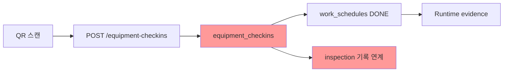

# Engine Connection Audit — 9 Engines Consumer Path

**Repo:** `taiengineering/tai-api`  
**Date:** 2026-06-08  
**Scope:** Analysis only (no code changes)  
**DB:** Supabase `vwlahtguyggrhvslabax` (counts verified via MCP)  
**Work order:** `docs/WORKORDER_ENGINE_CONNECTION_AUDIT.md` (로컬 기준; 레포 미동기화)

---

## Executive Summary

9개 엔진 중 **소비자(익명 진단·Safe 앱·작업자 앱)까지 단일 파이프라인으로 연결된 엔진은 없음**. 대부분 **이중 스택(Legacy + Runtime)** 또는 **엔진 데이터와 소비자 경로의 분리** 상태.

| # | Engine | Judgment | 핵심 이유 |
|---|--------|----------|-----------|
| 1 | Check/Inspection | **PARTIAL** | DB 327세트/5,184항목 존재, 익명 진단·작업자 앱은 Runtime 경로; 85% 세트에 일정 미생성 |
| 2 | Document | **DISCONNECTED** | `documents`=0, 소비자는 `runtime_document_data`; 마스터 63건은 관리자 전용 |
| 3 | Equipment | **PARTIAL** | 자산 1,285건 CRUD 연결, `equipment_checkins`=0 — 점검 기록 흐름 미가동 |
| 4 | Schedule | **PARTIAL** | Legacy `work_schedules`(60) vs Runtime `runtime_schedule`(339) 병행, 브릿지 테이블 0건 |
| 5 | Education | **PARTIAL** | 마스터 20건·설정 API 연결, `education_history`=0 |
| 6 | Contract | **PARTIAL** | SaaS `contracts`(4) vs 매칭 `matching_contracts`(0) 이원화 |
| 7 | Notification | **PARTIAL** | SaaS `notifications`(0) vs Runtime 큐(0); 엔진 API는 메트릭/데드레터 위주 |
| 8 | Runtime | **CONNECTED** | 20,129 work orders, 50,301 evidence — 브릿지 API가 소비자 진입점 |
| 9 | SaaS | **CONNECTED** | auth/users/companies/factories 정상 CRUD, 128사/342공장 |

**최우선 이슈:** 익명·통합 진단이 Phase 2 Compiler Core로 전환되면서 `evidence.chain` 생성 경로(`leg_candidate_adapter` → `obligation_standard_builder`)가 **소비자 경로에서 완전히 우회**됨.

---

## DB Snapshot (2026-06-08)

| Table | Count | Consumer reads? |
|-------|------:|-----------------|
| `inspection_sets` | 327 | SaaS `/inspection-sets` ✅ / 익명진단 ❌ |
| `inspection_set_items` | 5,184 | `worker_home` 설비점검 ✅ / 익명진단 ❌ / `inspection_bridge` ❌(주석 오류) |
| `work_schedules` | 60 | `/inspection/checklist` ✅ |
| `runtime_inspection_bridge` | 324 | `/bridge/inspection/sets` |
| `runtime_checklist_item` | 802 | `/bridge/inspection/checklists` |
| `runtime_operational_work_order` | 20,129 | `/bridge/my-inspection` ✅ |
| `runtime_inspection_session` | 100 | 작업자 점검 수행 ✅ |
| `documents` | **0** | `/documents` (Legacy) — 빈 테이블 |
| `document_form_master` | 63 | `/engine/forms` (관리자) |
| `generated_document` | 28 | `/document-engine/documents/{id}/generated` |
| `runtime_document_data` | 1 | `/document-engine/documents`, `/bridge/documents` |
| `runtime_form_schema` | 323 | 문서엔진 스키마 |
| `equipment_assets` | 1,285 | `/equipment-assets` ✅ |
| `equipment_checkins` | **0** | `/equipment-checkins` (API 존재, 미사용) |
| `work_schedules` (inspection_set linked) | 60 | 327세트 중 18%만 연결 |
| `runtime_schedule` | 339 | `/runtime/schedules` |
| `runtime_schedule_instance` | **0** | `/bridge/schedules` — 빈 테이블 |
| `runtime_instance` | 339 | Runtime projection |
| `education_master` | 20 | `/education` ✅ |
| `education_history` | **0** | 교육 이수 기록 미가동 |
| `contracts` | 4 | `/contracts` (SaaS 견적→계약) |
| `matching_contracts` | **0** | `/matching/contracts` (AI 계약엔진) |
| `quotes` | 23 | `/contracts` 견적 |
| `notifications` | **0** | `/notifications` (SaaS 인박스) |
| `notification_queue` | **0** | — |
| `runtime_notification_queue` | **0** | `/notification-engine` |
| `runtime_compliance_evidence` | 50,301 | `/bridge/compliance-evidence` |
| `runtime_candidate` | 7 | Binding Engine (극소) |
| `runtime_task` | 339 | Runtime cockpit |
| `companies` | 128 | SaaS Core |
| `factories` | 342 | SaaS Core |

---

## Judgment Legend

| Code | Meaning |
|------|---------|
| **CONNECTED** | Router → Service → DB → Consumer UI/API end-to-end 동작 |
| **PARTIAL** | 일부 경로만 연결; 데이터·소비자·엔진 중 하나 이상 단절 |
| **DISCONNECTED** | DB/엔진 데이터 존재하나 소비자가 읽는 테이블이 다름 |
| **DEAD** | API 존재하나 DB 0건 또는 write freeze로 실질 미가동 |
| **ACTIVE_NO_ENGINE** | 소비자 API 활성이나 엔진 테이블 우회 |

---

## Engine 1: Check / Inspection

**Judgment: PARTIAL**

### Router → Service → DB

| Router | Service / Logic | DB Tables |
|--------|-----------------|-----------|
| `routers/inspection_sets.py` | `services/inspection_sets_svc/*` | `inspection_sets`, `inspection_set_items`, `master_building_legal_rules`(조인 시도) |
| `routers/inspection_schedule.py` | 인라인 | `inspection_sets`, `work_schedules` |
| `routers/inspection_checklist.py` | 인라인 + `LEGAL_INSPECTION_ITEMS` 하드코드 | `work_schedules`, `inspection_set_items`(생성만) |
| `routers/schedule_engine.py` | 인라인 | `inspection_sets` → `work_schedules` |
| `routers/inspection_bridge.py` | 인라인 | `runtime_inspection_bridge`, `runtime_checklist_item` |
| `routers/my_inspection_bridge.py` | 인라인 | `runtime_inspection_session`, `runtime_operational_work_order` |
| `routers/worker_home.py` | 인라인 | `equipment_assets`, `inspection_sets`, `inspection_set_items` |
| `services/legal_adapter.py` | `project_rules()` | `inspection_sets` (진단→Binding 시) |
| `services/runtime_activation_service.py` | `_sync_inspection_set()` | `inspection_sets`, `inspection_set_items` |

Registry: `router_registry/inspection.py` (12 routers)

### 기획 경로 vs 실제 경로

```mermaid
flowchart LR
  subgraph planned [기획]
    D1[Diagnosis] --> BE[Binding Engine]
    BE --> IS[inspection_sets]
    IS --> ISI[inspection_set_items]
    ISI --> WS[work_schedules]
    WS --> Worker[작업자 앱]
  end

  subgraph actual_anon [실제 — 익명/통합 진단 Phase 2]
    D2[POST /anonymous-diagnosis] --> CC[Compiler Core temp factory]
    CC --> MEM[in-memory obligations]
    MEM --> TR[diagnosis_transform]
    TR --> Nexas[Nexas UI]
  end

  subgraph actual_saas [실제 — SaaS 운영]
    LE[LEGAL_ENGINE 배치] --> IS2[inspection_sets 326건]
    IS2 --> ISI2[items 5,184]
    RT[Runtime 20K WO] --> MI[/bridge/my-inspection]
  end
```

| 구간 | 기획 | 실제 |
|------|------|------|
| 진단 → 점검세트 | `project_rules` → `inspection_sets` | 익명: **미호출**(temp factory 즉시 삭제). 통합: `factory_id`+`company_id` 있을 때만 non-blocking 호출 |
| 세트 → 항목 | `generate-items` / activation sync | 324/327 세트에 항목 존재 (LEGAL_ENGINE 생성) |
| 항목 → 소비자 | 점검 UI에서 items 표시 | **작업자 앱**: Runtime checklist (802건). **설비 QR**: `worker_home`만 items 직접 조회. **익명 진단**: items 미노출 |
| evidence.chain | `leg_candidate_adapter` → `obligation.evidence.chain` | Compiler 경로: **chain 필드 없음** → Transform `evidence: []` |

### Priority Q1: 327세트 / 5,184항목이 소비자에게 보이는가?

| 소비자 | API | items 노출 | 판정 |
|--------|-----|-----------|------|
| 익명 진단 (Nexas) | `/anonymous-diagnosis/{token}/transform` | ❌ obligations만 (compiler task 요약) | **미노출** |
| Safe 관리자 | `GET /inspection-sets` | ❌ 목록만 (items 별도 API 없음) | **부분** |
| 점검리스트 | `GET /inspection/schedules` | `work_schedules` 기반 (60건) | **18%만** |
| 작업자 앱 | `GET /bridge/my-inspection` | Runtime session (100건) | **Runtime 경로** |
| 설비 QR | `worker_home` equipment endpoint | `inspection_set_items` 직접 조회 | **연결됨** (단, checkins 0) |

- 277/327 세트(85%)에 `work_schedules` 없음 → 점검리스트 UI 미노출
- `anchor_confirmed`=59건만 기준일 확정

### Priority Q1b: evidence.chain 어디서 끊겼는가?

```
[기획 — v5.10 / integrity audit 경로]
legal_v510_svc.run_diagnose_step1_v510
  → leg_candidate_adapter.to_candidate_contract  ← evidence_chain 생성
  → obligation_standard_builder.build_obligations ← evidence: { chain: [...] }

[실제 — 소비자 Phase 2]
anonymous_factory_service.run_anonymous_diagnosis
  → compiler_core_svc.fetch_compiler_candidates
  → _compiler_result_to_step1_format   ← evidence_chain 필드 없음
  → diagnosis_transform._extract_obligations ← evidence: [] (빈 배열)

[Binding Engine — 제한적]
diagnosis_integrated POST /diagnosis/run
  → project_rules (factory_id + company_id 필요)
  → inspection_sets 생성 (세트만, items는 activation 시)
```

**끊김 지점:**
1. **F-001 CRITICAL** — Compiler → step1 변환 시 `evidence_chain` 미생성
2. **F-002 HIGH** — `obligation_standard_builder`가 소비자 라우터 어디에도 호출되지 않음
3. **F-003 HIGH** — `diagnosis_transform`이 `evidence.chain` 구조를 읽지 않고 flat `evidence: []` 반환
4. **F-004 MEDIUM** — `leg_candidate_adapter`는 `legal_v510_svc` / 검증 스크립트 전용; 익명·통합 진단 미사용

---

## Engine 2: Document

**Judgment: DISCONNECTED**

### Router → Service → DB

| Router | Service | DB Tables |
|--------|---------|-----------|
| `routers/documents.py` | `services/document_svc.py` | `documents` (Legacy 파일 저장) |
| `routers/document_engine_api.py` | `services/document_engine_svc.py` | `runtime_form_schema`, `runtime_document_data`, `generated_document`, `evidence_vault_link` |
| `routers/document_engine.py` | `document_engine/fetchers`, `renderer` | `generated_document`, Storage |
| `routers/engine_document.py` | 인라인 | `document_form_master`, `form_templates` |
| `routers/runtime_bridge.py` | `document_engine_svc` | `runtime_document_data` (브릿지) |
| `routers/legacy_freeze.py` | — | Legacy write **410 차단** |

Registry: `router_registry/document_engine.py` (7 routers)

### 기획 vs 실제

| Layer | 기획 | 실제 DB | 소비자가 읽는 테이블 |
|-------|------|---------|-------------------|
| 파일 보관 | `documents` | **0건** | ❌ (빈 테이블) |
| 서식 마스터 | `document_form_master` | 63건 | 관리자 `/engine/forms` only |
| Runtime 문서 | `runtime_document_data` | 1건 | `/document-engine/documents`, `/bridge/documents` |
| PDF 생성물 | `generated_document` | 28건 | generate 엔드포인트 후 조회 |
| 스키마 | `runtime_form_schema` | 323건 | 문서엔진 내부 |

**F-005 HIGH** — `documents`=0인데 Legacy `/documents` 라우터는 여전히 등록. Write는 `legacy_freeze`로 차단, Read는 빈 결과.

**F-006 HIGH** — 소비자 문서 경로는 Runtime(`runtime_document_data`)으로 이전됐으나 실데이터 1건. 63개 마스터 서식·28개 생성 PDF와 **미연결**.

**F-007 MEDIUM** — `document_engine.py` (TBM PDF) fetcher 레지스트리에 `DOC-OSH-056` 1건만 등록 — 대부분 서식 미연결.

---

## Engine 3: Equipment

**Judgment: PARTIAL**

### Router → Service → DB

| Router | DB Tables |
|--------|-----------|
| `routers/equipment_assets.py` | `equipment_assets`, `equipment_model_master`, `v_equipment_unified` |
| `routers/equipment_checkins.py` | `equipment_checkins`, `work_schedules`(완료 처리), `notifications`(NG/HOLD 알림) |
| `routers/engine_equipment.py` | 엔진 설정용 마스터 |
| `routers/worker_home.py` | `equipment_assets` → `inspection_sets` → `inspection_set_items` |

Registry: `router_registry/construction.py`

### 기획 vs 실제



| 구간 | 상태 |
|------|------|
| 자산 CRUD | ✅ 1,285건, API 연결 |
| QR 체크인 API | ✅ 구현 완료 |
| 체크인 DB | ❌ **0건** — 흐름 미가동 |
| 체크인 → 일정 완료 | 코드 존재 (`schedule_id` + OK 시 `work_schedules` update) |
| 체크인 → Runtime evidence | ❌ 연결 없음 |
| 설비 → 점검항목 | ✅ `worker_home` (items 조회) |

**F-008 HIGH** — `equipment_checkins`=0: 점검 기록 파이프라인 **코드만 존재, 운영 데이터 없음**.

**F-009 MEDIUM** — `worker_home` 설비 조회가 `equipment_assets.name` 컬럼 참조하나 실제 스키마는 `asset_name` — 런타임 404 가능성.

---

## Engine 4: Schedule

**Judgment: PARTIAL**

### Router → Service → DB

| Router | Service | DB |
|--------|---------|-----|
| `routers/schedule_engine.py` | 인라인 | `inspection_sets` → `work_schedules` |
| `routers/work_schedules.py` | 인라인 | `work_schedules` |
| `routers/schedule_pipeline.py` | 인라인 | 파이프라인 orchestration |
| `routers/overdue_checker.py` | 인라인 | `work_schedules` |
| `routers/runtime_schedule_api.py` | `runtime_schedule_service` | `runtime_schedule`, `runtime_task` |
| `routers/runtime_bridge.py` | `persistence_svc` | `runtime_schedule_instance` (**0건**) |

### 기획 vs 실제

| Stack | Table | Count | Consumer |
|-------|-------|------:|----------|
| Legacy | `work_schedules` | 60 | `/inspection/checklist`, `equipment_checkins` |
| Runtime | `runtime_schedule` | 339 | `/runtime/schedules` |
| Runtime | `runtime_instance` | 339 | projection layer |
| Bridge | `runtime_schedule_instance` | **0** | `/bridge/schedules` |

**F-010 HIGH** — 이중 스택: Legacy 일정 60건 vs Runtime 339건. 브릿지 테이블 0건으로 `/bridge/schedules`는 항상 빈 배열.

**F-011 MEDIUM** — 277 inspection_sets에 일정 미생성 (`schedule_engine` 수동 트리거 필요).

---

## Engine 5: Education

**Judgment: PARTIAL**

### Router → Service → DB

| Router | DB Tables |
|--------|-----------|
| `routers/education.py` | `education_master`, `company_education_setting`, `education_setting`, `education_history` |
| `routers/education_assign.py` | `education_assignments` (배정) |

Registry: `router_registry/construction.py`

| Table | Count | Status |
|-------|------:|--------|
| `education_master` | 20 | ✅ 마스터 연결 |
| `education_history` | **0** | ❌ 이수 기록 미가동 |

**F-012 MEDIUM** — 설정·마스터 API는 CONNECTED, 이수 이력(`education_history`) DEAD.

---

## Engine 6: Contract

**Judgment: PARTIAL**

### Router → Service → DB

| Router | Service | DB |
|--------|---------|-----|
| `routers/contracts.py` | 인라인 | `quotes`, `contracts`, `companies` |
| `routers/contracts_engine.py` | `contract_engine_svc`, `contract_ai` | `matching_contracts`, `matching_requests`, `matching_results`, Storage |
| `routers/quotes.py` | 인라인 | `quotes` |

Registry: `router_registry/payment.py`

| Track | Table | Count | Entry |
|-------|-------|------:|-------|
| SaaS 견적→계약 | `contracts` | 4 | `/contracts` |
| AI 매칭 계약 | `matching_contracts` | **0** | `/matching/contracts/generate` |

**F-013 MEDIUM** — 두 계약 트랙이 공존하나 `matching_contracts` 미가동. 소비자(매칭 플랫폼) 경로 DEAD, SaaS 계약 4건만 ACTIVE.

---

## Engine 7: Notification

**Judgment: PARTIAL**

### Router → Service → DB

| Router | DB Tables |
|--------|-----------|
| `routers/notifications.py` (SaaS) | `notifications`, `notification_settings` |
| `routers/notification_engine_api.py` | `runtime_notification_queue`, `runtime_notification_event`, metrics/deadletter |
| `routers/notification_bridge.py` | Runtime bridge |
| `routers/notification_inbox_api.py` | 인박스 |
| `equipment_checkins.py` | `notifications` (NG/HOLD 시 insert) |

| Table | Count |
|-------|------:|
| `notifications` | **0** |
| `notification_queue` | **0** |
| `runtime_notification_queue` | **0** |

**F-014 MEDIUM** — SaaS 인박스·Runtime 큐 모두 0건. API·크론(`trigger-due-alerts`)은 존재하나 발송 이력 없음.

**F-015 LOW** — `notification_engine_api`는 운영 메트릭/데드레터 조회 위주; 소비자 인박스는 `notifications.py` / `notification_inbox_api`.

---

## Engine 8: Runtime

**Judgment: CONNECTED**

### Router → Service → DB

Registry: `router_registry/runtime_bridge.py` (24 routers)

| Router | DB | Count |
|--------|-----|------:|
| `my_inspection_bridge` | `runtime_inspection_session`, `runtime_operational_work_order` | 100 / 20,129 |
| `evidence_bridge` | `runtime_compliance_evidence` | 50,301 |
| `runtime_cockpit_api` | `runtime_cockpit_service` → tasks/docs/evidence | — |
| `runtime_candidate_api` | Binding → Activation | `runtime_candidate` 7 |
| `runtime_bridge` | bridge to evaluator/persistence | — |
| `obligation_bridge` | obligation projection | — |

Runtime이 **실질 운영 데이터의 허브**. 작업자 점검·증빙·일정 projection이 여기 집중.

**F-016 MEDIUM** — `runtime_candidate`=7건으로 Binding Engine 투입 극소. 대부분 데이터가 Legacy/배치(`LEGAL_ENGINE`) 또는 직접 Runtime 생성 경로.

**F-017 LOW** — `inspection_bridge.py` 주석 "inspection_set_items=0"은 **DB 사실(5,184건)과 불일치** — stale documentation in code.

---

## Engine 9: SaaS Core

**Judgment: CONNECTED**

### Router → DB

Registry: `router_registry/saas_core.py`

| Router | DB Tables | Count |
|--------|-----------|------:|
| `auth.py` | `users`, `otp_store` | users ~20 |
| `companies.py` | `companies` | 128 |
| `factories.py` | `factories`, `buildings` | 342 |
| `users.py` | `users` | — |
| `onboarding.py` | onboarding flow + `inspection_set_items` count | — |
| `notifications.py` | (see Engine 7) | 0 |
| `system_codes.py` | `system_codes` | — |

SaaS Core는 인증·테넌트·시설 CRUD가 정상 연결. 엔진 데이터와는 별도 레이어.

---

## Cross-Cutting: Consumer Diagnosis Path (Phase 2)

현재 익명·통합 진단 step1 공통 경로:

```
POST /anonymous-diagnosis | POST /diagnosis/run
  → diagnosis_integrated_svc.run_step1_via_compiler
  → anonymous_factory_service.run_anonymous_diagnosis
      1. create_temp_factory (factories INSERT)
      2. evaluate_single_factory (facility_applicability INSERT)
      3. fetch_compiler_candidates
      4. _compiler_result_to_step1_format
      5. cleanup_temp_factory (DELETE factories + applicability)
```

**영향:**
- 진단 결과는 **DB에 영구 저장되지 않음** (anonymous_diagnosis는 `diagnosis_auth_log.result_data` JSONB에만 저장)
- `inspection_sets` / `project_rules` / `evidence.chain` **우회**
- `factory_id` 있는 통합 진단만 Binding Engine non-blocking 호출

**F-018 CRITICAL** — Compiler Phase 2가 소비자 진단의 단일 경로가 되면서, 기획된 Legal→Inspection→Evidence 파이프라인과 **구조적 분리** 발생.

---

## Findings Index

| ID | Severity | Engine | Finding |
|----|----------|--------|---------|
| F-001 | **CRITICAL** | Inspection | Compiler `_compiler_result_to_step1_format`이 `evidence_chain` 미생성 → 소비자 evidence.chain 항상 빈 값 |
| F-002 | **HIGH** | Inspection | `obligation_standard_builder`가 프로덕션 소비자 라우터에서 미호출 |
| F-003 | **HIGH** | Inspection | `diagnosis_transform._extract_obligations`가 `evidence.chain` 구조 미지원, `evidence: []` 고정 |
| F-004 | **MEDIUM** | Inspection | `leg_candidate_adapter`는 v5.10/검증 전용; 익명·통합 진단 미연결 |
| F-005 | **HIGH** | Document | `documents` 테이블 0건 + Legacy read API 잔존 |
| F-006 | **HIGH** | Document | 63 마스터 서식·28 generated_document가 Runtime 소비자 경로(1건)와 단절 |
| F-007 | **MEDIUM** | Document | `document_engine.py` fetcher 1종만 등록 |
| F-008 | **HIGH** | Equipment | `equipment_checkins`=0, QR 점검 파이프라인 미가동 |
| F-009 | **MEDIUM** | Equipment | `worker_home` 컬럼명 불일치 가능 (`name` vs `asset_name`) |
| F-010 | **HIGH** | Schedule | Legacy(60) / Runtime(339) / Bridge(0) 삼중 스택, 브릿지 dead |
| F-011 | **MEDIUM** | Schedule | 277/327 inspection_sets에 work_schedules 없음 |
| F-012 | **MEDIUM** | Education | `education_history`=0, 이수 기록 DEAD |
| F-013 | **MEDIUM** | Contract | `matching_contracts`=0, AI 계약 엔진 미가동 |
| F-014 | **MEDIUM** | Notification | SaaS·Runtime 알림 큐 모두 0건 |
| F-015 | **LOW** | Notification | 엔진 API vs 인박스 API 역할 분산 |
| F-016 | **MEDIUM** | Runtime | `runtime_candidate`=7, Binding 투입 극소 |
| F-017 | **LOW** | Runtime | `inspection_bridge` stale 주석 (items=0 ≠ 실제 5,184) |
| F-018 | **CRITICAL** | Cross | Phase 2 Compiler 소비자 경로가 Legal→Inspection→Evidence 엔진 체인 우회 |
| F-019 | **HIGH** | Inspection | 5,184 items가 익명 진단·작업자 Runtime 경로에 미노출; SaaS·설비QR만 부분 노출 |
| F-020 | **MEDIUM** | Inspection | `inspection_sets_svc`가 `master_building_legal_rules` 조인 — 테이블 부재 시 enrichment 실패 (LEGAL_ENGINE_AUDIT F-003 연계) |

---

## Recommended Investigation Order (참고 — 수정 아님)

1. **evidence.chain 복구 설계** — Compiler output에 `rule_id`/`source_bucket` 전파 → Transform 호환
2. **inspection_sets → work_schedules 일괄 생성** — 277 orphan sets
3. **Document 테이블 단일화** — `runtime_document_data` ← `document_form_master` 시드 연결
4. **equipment_checkins 파일럿** — 1개 factory에서 E2E 검증
5. **Schedule 브릿지** — `runtime_schedule_instance` backfill 또는 bridge 라우터를 `runtime_schedule`로 교체 검토
6. **inspection_bridge 주석/로직** — 5,184 items 인지하도록 정합성 수정 (별도 work order)

---

## Audit Method

- Router registry 9그룹 (`inspection`, `document_engine`, `construction`, `payment`, `runtime_bridge`, `saas_core`) 파일 추적
- `grep '.table('` 로 DB 접근 테이블 확인
- Supabase MCP `execute_sql` 로 건수 검증
- 소비자 경로: `anonymous_diagnosis`, `diagnosis_integrated`, `diagnosis_transform`, bridge routers
- 코드 수정 없음

---

*End of audit.*
