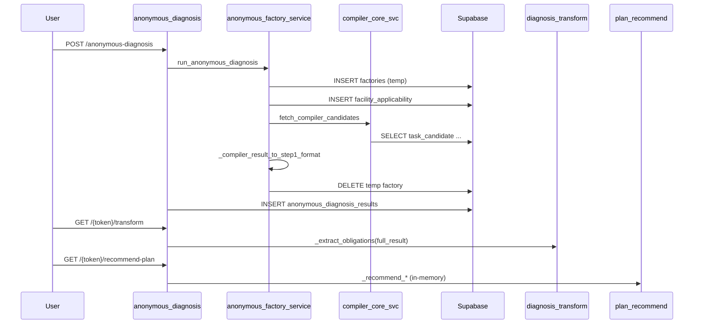
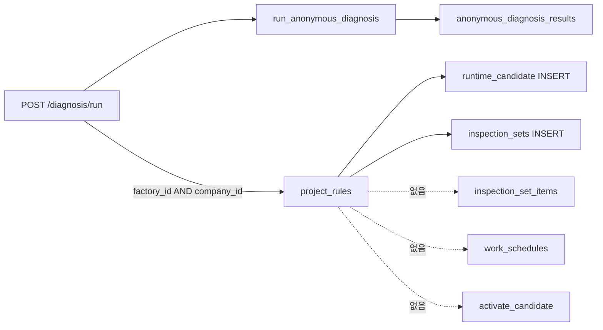
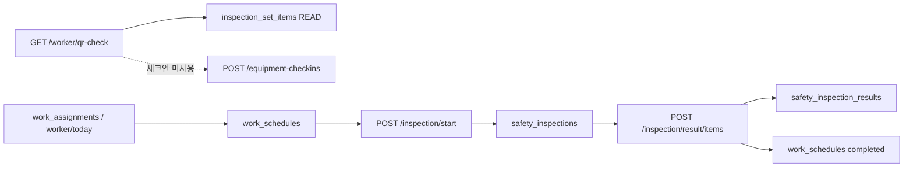
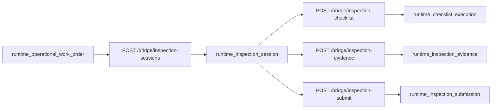

# Engine Pipeline Map — 소비자 여정 & 엔진 연결 지도

**Repo:** `taiengineering/tai-api`  
**Date:** 2026-06-08  
**Work order:** `docs/WORKORDER_ENGINE_PIPELINE_MAP.md` (레포 미동기화 — 본 문서는 코드 추적 기준)  
**방법:** Router → Service → DB read/write → 다음 단계. **건수·DB 통계로 판단하지 않음.**

---

## 0. 전체 지도 (요약)

현재 코드베이스에는 **소비자 진단·SaaS 운영·Runtime 점검**이 **3개의 평행 트랙**으로 존재한다.

```mermaid
flowchart TB
  subgraph T1 [트랙 A — 소비자 진단 Compiler Temp]
    AD[POST /anonymous-diagnosis]
    DR[POST /diagnosis/run]
    AFS[anonymous_factory_service]
    CC[compiler_core_svc.fetch_compiler_candidates]
    AD --> AFS
    DR --> AFS
    AFS --> CC
    AFS -->|cleanup| DEL[DELETE factories + facility_applicability]
  end

  subgraph T2 [트랙 B — 기획 Compiler Session / SaaS Setup]
    DE[POST /api/v1/diagnosis-engine/evaluate]
    DS[DiagnosisService.evaluate]
    SS[POST /api/v1/saas-setup/extract]
    DE --> DS --> DSDB[(diagnosis_session / diagnosis_candidate)]
    SS --> SSSDB[(saas_setup_candidate)]
  end

  subgraph T3 [트랙 C — SaaS 운영 Legacy + Runtime]
    IS[inspection_sets / work_schedules]
    MI[/bridge/my-inspection]
    EC[equipment_checkins]
    IS --> MI
    EC -.->|미연결| MI
  end

  T1 -.->|factory_id+company_id 시 project_rules| T3
  T1 -.->|auto_create 없음| IS
  T2 -.->|register 로그만| T3
```

| 트랙 | 소비자 | 진단 엔진 진입 | 점검·일정·문서 후속 |
|------|--------|----------------|-------------------|
| **A** | Nexas 무료/유료 진단 | `run_anonymous_diagnosis` | Binding·세트·항목 **대부분 미연결** |
| **B** | Admin/내부 SaaS 온보딩 설계 | `DiagnosisService` + `saas_setup` | 승인 후 `saas_registration_log` (Runtime 실등록 코드 없음) |
| **C** | Safe 앱·작업자 앱 | `legal_engine/apply`, 건설 `auto_diagnose` 등 | `inspection_sets`, `work_schedules`, Runtime bridge |

---

## A. 소비자 여정 4종 — 단계별 추적

### A-1. 무료 진단: `POST /anonymous-diagnosis` → 결과 조회 → 플랜 추천

**Registry:** `router_registry/public.py` → `routers.anonymous_diagnosis`

| Step | Endpoint / 함수 | Router | Service | DB Read | DB Write | 다음 단계 |
|------|-----------------|--------|---------|---------|----------|-----------|
| 1 | `POST /anonymous-diagnosis` | `anonymous_diagnosis.create_anonymous_diagnosis` | `_build_step1_body` → `_run_step1_via_service` | — | — | step1 실행 |
| 2 | Compiler step1 | ↑ | `anonymous_factory_service.run_anonymous_diagnosis` | `draft_slot`, `factories`, `facility_applicability`, `task_candidate`, `schedule_candidate`, … | `factories` INSERT, `facility_applicability` INSERT | format |
| 2b | | ↑ | `compiler_core_svc.fetch_compiler_candidates` | `facility_applicability`, `task_candidate`, `schedule_candidate`, `penalty_obligation_relation`, `compliance_review_queue` | — | — |
| 2c | | ↑ | `_compiler_result_to_step1_format` | — (메모리) | — | **leg_candidate_adapter 미호출** |
| 2d | | ↑ | `cleanup_temp_factory` | — | `facility_applicability` DELETE, `factories` DELETE | temp 제거 |
| 3 | Trace | ↑ | `watch_engine.create_trace` / `emit_event` | — | (trace bus) | — |
| 4 | 결과 저장 | ↑ | 인라인 | — | `anonymous_diagnosis_results` INSERT (`partial_result`, `full_result` JSONB) | 조회 가능 |
| 5 | Document hook (non-blocking) | ↑ | `watch_engine.document.activate_documents_for_workflow` | `document_form_master` | `generated_document` INSERT (조건부) | **소비자 문서함(`runtime_document_data`)과 무관** |
| 6 | `GET /anonymous-diagnosis/{token}` | `get_anonymous_diagnosis` | `_fetch_row` | `anonymous_diagnosis_results` SELECT | — | partial/full |
| 7 | `GET /anonymous-diagnosis/{token}/transform` | `transform_anonymous_diagnosis` | `diagnosis_transform._extract_*` | `anonymous_diagnosis_results` (full_result JSONB만) | — | UI 표준 스키마 |
| 8 | `GET /anonymous-diagnosis/{token}/recommend-plan` | `recommend_plan_by_token` | `diagnosis_plan_recommend._recommend_*` | `anonymous_diagnosis_results` | — | 플랜 코드 (DB 없음) |

**끊긴 연결 (코드상 호출 없음):**
- `inspection_set_auto.auto_create_inspection_sets_from_diagnosis` ❌
- `legal_adapter.project_rules` ❌ (factory_id 없음 + temp factory 삭제)
- `saas_setup.extract` ❌ (`diagnosis_session` 미생성)
- `to_candidate_contract` / `build_obligations` ❌



---

### A-2. 유료 진단: `POST /diagnosis/run` → 점검 항목 생성 → 일정

**Registry:** `router_registry/diagnosis.py` → `routers.diagnosis_integrated`

| Step | Endpoint | Router | Service | DB Read | DB Write | 다음 단계 |
|------|----------|--------|---------|---------|----------|-----------|
| 0a | `POST /diagnosis/auth/prepare` | `diagnosis_integrated` | — | — | — | 이니시스 |
| 0b | `POST /diagnosis/disclaimer` | ↑ | `diagnosis_integrated_svc.save_disclaimer` | `diagnosis_auth_log` | `diagnosis_disclaimer_log` INSERT | — |
| 1 | `POST /diagnosis/run` | `run_diagnosis` | `diagnosis_integrated_svc.run_diagnosis` | `diagnosis_auth_log`, `diagnosis_disclaimer_log` | — | step1 |
| 2 | Step1 (Phase 2) | ↑ | `run_step1_via_compiler` → `run_anonymous_diagnosis` | (A-1과 동일) | temp factory RW 후 DELETE | full_result |
| 3 | 결과 저장 | ↑ | `run_diagnosis` | — | `anonymous_diagnosis_results` INSERT, `diagnosis_auth_log` UPDATE, `diagnosis_purchases` INSERT(유료) | token 반환 |
| 4 | Binding (조건부) | `run_diagnosis` (router) | `legal_adapter.project_rules` | `inspection_sets` (중복체크) | `runtime_candidate`*, `inspection_sets` INSERT†, `runtime_candidate_*_req` | activation 없음 |
| 4b | rules 변환 | ↑ | `convert_rules_table_to_matched_rules` | — | — | — |

\* `runtime_binding_engine.project_candidate`  
† `_create_inspection_set` — `law_name` 있을 때만, **items 없음**

**점검 항목 생성 — 기획 vs 코드:**

| 기획상 기대 | 실제 코드 경로 | 연결 |
|-------------|----------------|------|
| 진단 완료 → `auto_create_inspection_sets_from_diagnosis` | `inspection_set_auto.py` | ❌ `diagnosis_integrated`에서 **미호출** (dead: `legal_engine_svc.run_diagnose_step1_endpoint`만 호출) |
| 진단 → `generate_items_for_set` | `inspection_sets.py` → `inspection_sets_svc.generate_items_for_set` | ❌ 진단 후 자동 호출 없음 (수동 API) |
| Binding → `runtime_activation_service.activate_candidate` | `runtime_candidate_api` | ❌ `project_rules`는 **project만**, activate 없음 |
| Binding → `inspection_set_items` | `runtime_activation_service._sync_inspection_set` | ❌ activate 경로 미진입 |

**일정 생성 — 기획 vs 코드:**

| 경로 | 코드 | 진단 후 자동? |
|------|------|---------------|
| `work_schedules` | `schedule_engine.generate_schedule`, `inspection_checklist` rolling | ❌ `/diagnosis/run`에서 미호출 |
| `runtime_candidate_schedule` | `project_candidate` (schedule_suggestion 있을 때) | ❌ `legal_adapter`가 `schedule_suggestion` **미전달** |
| 건설 현장 | `construction_svc.auto_diagnose_and_schedule` | ⚠️ `/diagnosis/run`과 **별도** (construction 등록 시) |



---

### A-3. SaaS 사용: 대시보드 → 점검 → 설비 → 교육 → 문서

SaaS UI는 **단일 대시보드 API가 아니라** 기능별 라우터 조합이다.

#### 대시보드 / 온보딩

| 화면 | Endpoint | Router | DB Read | DB Write |
|------|----------|--------|---------|----------|
| 온보딩 체크리스트 | `GET /onboarding/status` | `onboarding.py` | `factories`, `factory_process`, `equipment_assets`, `inspection_sets`, `inspection_set_items` | — |
| 상황 대시보드 | `GET /situation/dashboard/overview` | `situation_dashboard_api.py` | `operational_situation_snapshot` | — |
| 위험성평가 대시 | `GET /risk-assessments/dashboard` | `risk_assessments.py` | `risk_assessments` 등 | — |

온보딩은 **진단 파이프라인과 import 없음** — 등록 여부만 COUNT.

#### 점검 (관리자 / Legacy 스택)

| 동작 | Endpoint | Service/Logic | DB Read | DB Write |
|------|----------|---------------|---------|----------|
| 점검세트 목록 | `GET /inspection-sets` | `inspection_sets_svc.get_sets_list` | `inspection_sets`, `master_building_legal_rules`(조인 시도) | — |
| 항목 생성 | `POST /inspection-sets/{id}/generate-items` | `inspection_sets_svc.generate_items_for_set` | `inspection_sets` | `inspection_set_items` INSERT |
| 일정 목록 | `GET /inspection/schedules/{factory_id}` | `inspection_checklist.list_schedules` | `work_schedules` + `inspection_sets` JOIN | — |
| 일정 생성 | `POST /schedule-engine/generate/{inspection_set_id}` | `schedule_engine.generate_schedule` | `inspection_sets` | `work_schedules` INSERT |
| 점검 시작 | `POST /inspection/start/{work_schedule_id}` | `inspection_checklist` | `work_schedules` | `work_schedules` UPDATE, `safety_inspections` INSERT |
| 결과 기록 | `POST /inspection/result/{id}/items` | ↑ | `safety_inspections` | `safety_inspection_results` INSERT |

**법령엔진 → 점검세트 (SaaS 측 유일 자동 경로):**

| Trigger | Code | Connection |
|---------|------|------------|
| `POST /legal-engine/apply/{factory_id}` | `legal_engine_svc` → (runtime apply) | 배치 적용 |
| `POST /legal-engine/create-inspection-sets/{factory_id}` | `run_create_inspection_sets_from_legal` | 수동 |
| 건설 현장 등록 | `construction_svc.auto_diagnose_and_schedule` → `auto_create_inspection_sets_from_diagnosis` | ✅ 코드 있음 |
| `run_diagnose_step1_endpoint` (dead) | `auto_create_inspection_sets_from_diagnosis` | 라우터 미연결 |

#### 점검 (작업자 / Runtime 스택)

| 동작 | Endpoint | DB |
|------|----------|-----|
| 오늘 할일 | `GET /worker/today` | `work_assignments`, `inspection_sets`, TBM, `education_*` |
| 내 점검 | `GET /bridge/my-inspection` | `runtime_inspection_session`, `runtime_operational_work_order` |
| 세션 시작 | `POST /bridge/inspection-sessions` | `runtime_inspection_session` INSERT |

**Legacy `inspection_set_items` ↔ Runtime `runtime_checklist_item`:** `inspection_bridge.py`가 매핑 조회. **진단→Runtime 자동 sync 코드 없음.**

#### 설비

| 동작 | Endpoint | DB Read | DB Write |
|------|----------|---------|----------|
| 자산 CRUD | `/equipment-assets` | `equipment_assets` | `equipment_assets` |
| QR → 점검세트 조회 | `GET /worker/qr-check/{equipment_id}` | `equipment_assets`, `inspection_sets`, `inspection_set_items` | — |
| QR 체크인 제출 | `POST /equipment-checkins` | `equipment_assets`, `factories` | `equipment_checkins` INSERT; optional `work_schedules` UPDATE |

`equipment_checkins` → Runtime / `safety_inspection_results` **import·호출 없음**.

#### 교육

| 동작 | Endpoint | DB |
|------|----------|-----|
| 마스터·설정 | `GET/POST /education/*` | `education_master`, `company_education_setting`, `education_setting` |
| 이수 기록 | `POST /education/history` 등 | `education_history` |

진단·Compiler와 **연결 코드 없음**.

#### 문서

| 역할 | Endpoint | 테이블 |
|------|----------|--------|
| 관리자 서식 | `GET /engine/forms` | `document_form_master`, `form_templates` |
| 소비자 Runtime 문서 | `GET/POST /document-engine/documents` | `runtime_document_data`, `runtime_form_schema` |
| Legacy 파일 | `GET/POST /documents` | `documents` (write frozen → 410) |
| 브릿지 | `GET /bridge/documents` | `document_engine_svc` → `runtime_document_data` |
| PDF/TBM | `GET /document-forms/{id}/preview` | `generated_document`, `document_form_master` (watch_engine) |

**3계층 분리:** `document_form_master` (정의) → `runtime_form_schema` (Runtime 스키마) → `runtime_document_data` (인스턴스). **자동 매핑 import 없음.**

---

### A-4. 점검 실행: QR → 체크리스트 → 완료 → 증적

코드상 **두 개의 실행 파이프라인**이 병존한다.

#### 파이프라인 4a — Legacy (`work_schedules` 중심)



| Step | Router | DB Write | → 증적 |
|------|--------|----------|--------|
| QR 조회 | `worker_home` | — | items 표시만 |
| 체크인 | `equipment_checkins` | `equipment_checkins` | `photo_urls` JSON 필드만; **evidence 테이블 없음** |
| 체크리스트 수행 | `inspection_checklist` | `safety_inspection_results` | `photo_url` 컬럼 |
| 완료 | `inspection_checklist.complete` | `work_schedules` + 다음 회차 INSERT | — |

**`runtime_compliance_evidence` / `evidence_bridge` 호출 없음.**

#### 파이프라인 4b — Runtime (`my_inspection_bridge`)



| Step | Router | DB | 다음 |
|------|--------|-----|------|
| 세션 시작 | `my_inspection_bridge` | `runtime_inspection_session` INSERT, `runtime_operational_work_order` UPDATE | checklist |
| 항목 수행 | ↑ | `runtime_checklist_execution` INSERT | evidence |
| 증빙 업로드 | ↑ | `runtime_inspection_evidence` INSERT | submit |
| 제출 | ↑ | `runtime_inspection_submission` INSERT, session → SUBMITTED | review queue (코드 주석) |

**끊김:**
- `runtime_inspection_evidence` → `runtime_compliance_evidence` (**`evidence_bridge` 미호출**)
- `equipment_checkins` → Runtime session (**경로 없음**)
- `inspection_set_items` → `runtime_checklist_execution` (**자동 sync 없음**)
- Submit 후 `evidence_binding_engine` / compliance promotion **import 없음**

#### 파이프라인 4c — Compliance Evidence (독립)

`evidence_bridge.py`: `POST /bridge/upload-evidence` → `runtime_compliance_evidence`  
**점검 완료·체크인·Legacy 결과 기록 어디에서도 호출되지 않음** (grep 기준 호출처 = 라우터 자체 + verification 스크립트).

---

## B. 엔진 간 연결 매트릭스

화살표: `소스 → 타겟`. **import/호출**과 **소비자 경로에서 실제 실행**을 분리 표기.

| From → To | 호출 코드 존재 | 소비자 경로 실행 | 경로 요약 |
|-----------|:-------------:|:----------------:|-----------|
| **진단(Compiler temp)** → **점검세트** | ❌ | ❌ | `auto_create` / `generate_items` 미연결 |
| **진단(Compiler temp)** → **점검항목** | ❌ | ❌ | — |
| **진단(/diagnosis/run)** → **Binding** | ✅ `diagnosis_integrated` → `project_rules` | ⚠️ `factory_id`+`company_id` 있을 때만 | `runtime_candidate` + `inspection_sets` |
| **Binding** → **Activation** | ✅ `runtime_candidate_api` → `activate_candidate` | ❌ 진단 후 자동 없음 | 수동 API |
| **Activation** → **inspection_set_items** | ✅ `runtime_activation_service._sync_inspection_set` | ❌ activate 미진입 | — |
| **진단** → **일정(work_schedules)** | ✅ `schedule_engine`, `construction_svc` | ❌ `/diagnosis/run` 후 없음 | 건설 등록·수동 API만 |
| **진단** → **일정(runtime_schedule)** | ✅ `runtime_schedule_service` | ❌ 진단 후 자동 없음 | — |
| **진단** → **문서(runtime_document_data)** | ❌ | ❌ | — |
| **진단** → **문서(generated_document)** | ✅ `watch_engine.document` hook | ✅ 무료 진단 POST (non-blocking) | `document_form_master` 기반 |
| **진단-engine** → **saas-setup** | ✅ `saas_setup_service.extract` | ❌ Nexas 진단이 session 생성 안 함 | 별도 `POST /diagnosis-engine/evaluate` 필요 |
| **saas-setup register** → **Runtime** | ⚠️ `register_to_runtime` | ⚠️ `saas_registration_log` INSERT만 | 주석: "실제 Runtime 등록은 기존 시스템" |
| **legal-engine/apply** → **inspection_sets** | ✅ `run_create_inspection_sets_from_legal` | ✅ SaaS 수동/배치 | `/legal-engine/create-inspection-sets` |
| **설비(QR)** → **점검항목** | ✅ `worker_home` GET | ✅ 조회만 | write 없음 |
| **설비(checkin)** → **점검기록** | ✅ `equipment_checkins` POST | ⚠️ API만 존재 | downstream 없음 |
| **설비** → **증적(compliance)** | ❌ | ❌ | — |
| **점검(Runtime submit)** → **증적(compliance)** | ❌ | ❌ | `runtime_inspection_evidence`에만 머무름 |
| **점검(Legacy result)** → **증적(compliance)** | ❌ | ❌ | `safety_inspection_results.photo_url` |
| **Compiler API** → **소비자 진단** | ✅ 공유 `fetch_compiler_candidates` | ✅ | `/api/v1/compiler`와 anonymous **동일 svc**, 다른 orchestration |

---

## C. 기획서 vs 실제 코드 — `SESSION_2026_05_11_FULL_PIPELINE.md` 대조

기획 문서: 레포 루트 `SESSION_2026_05_11_FULL_PIPELINE.md` (v5.40, 2026-05-11)

### C-1. 일치 구간

| 기획 | 코드 | 일치 |
|------|------|------|
| Compiler Core 14단계 배치 파이프라인 | `scripts/run_*`, `constraint_*`, `task_candidate` … 테이블 | ✅ 배치·테이블 존재 |
| `POST /api/v1/compiler/evaluate-facility` | `routers/compiler_core.py` → `fetch_compiler_candidates` | ✅ |
| `POST /api/v1/diagnosis-engine/evaluate` | `routers/diagnosis_engine.py` → `DiagnosisService.evaluate` | ✅ |
| 진단은 Candidate만, 반복설정 확정 안 함 | `diagnosis_service.py` docstring·구현 | ✅ |
| `POST /api/v1/saas-setup/extract\|approve\|register` | `routers/saas_setup.py` → `SaaSSetupService` | ✅ |
| Legacy Runtime Layer 55+ 라우터 유지 | `router_registry/*` | ✅ |
| Candidate→Truth 승격 금지 철학 | Binding `project_candidate` status=`projected` | ✅ (설계 의도) |

### C-2. 갈라진 지점 (Fork)

| # | 기획서 서술 | 실제 소비자 코드 | 갈라짐 |
|---|-------------|------------------|--------|
| **F-01** | §4-2: 소비자 진단 → `POST /diagnosis-engine/evaluate` | Nexas: `POST /anonymous-diagnosis`, `POST /diagnosis/run` → **`run_anonymous_diagnosis`** | **진단 진입 API 불일치**. `diagnosis_session` 미생성 |
| **F-02** | §4-2: 진단 후 `saas-setup/extract` | anonymous/integrated는 `anonymous_diagnosis_results`만 저장 | **extract 체인 단절** |
| **F-03** | §4-2: `register` → Runtime 등록 | `register_to_runtime` = `saas_registration_log` INSERT | **Runtime 실등록 코드 없음** |
| **F-04** | Compiler → Applicability/Task 평가 | Consumer: on-demand temp `facility_applicability` + global `task_candidate` READ | **평가 방식 분기** (배치 vs temp) |
| **F-05** | Phase 2 merge 후 통합 진단 | `diagnosis_integrated` → `run_step1_via_compiler` (2026-06) | 기획서 **미반영** (v5.10 `legal_v510_svc` 경로와 별도) |
| **F-06** | v5.10 `to_candidate_contract` + evidence | Compiler `_compiler_result_to_step1_format` | **Adapter/Builder 우회** |
| **F-07** | 진단 → 점검세트 자동생성 (BE-1) | `auto_create` = dead endpoint + construction만 | **Nexas 진단 미연결** |
| **F-08** | Runtime이 Compiler consume | Comment in `compiler_core.py`; 실제 Legacy는 `inspection_schedule`·`legal_engine` 혼용 | **부분 소비** |
| **F-09** | 단일 증적 계층 | `runtime_inspection_evidence` ≠ `runtime_compliance_evidence` | **증적 이중 스택, 미연결** |
| **F-10** | 문서 엔진 통합 | `document_form_master` / `runtime_document_data` / `generated_document` 3갈래 | **소비자 read 경로 분리** |

### C-3. 기획 다이어그램 vs 2026-06 소비자 실경로

**기획 (SESSION §4-2):**
```
입력 → diagnosis-engine/evaluate → Compiler → diagnosis_session
     → saas-setup/extract → approve → register → Runtime
```

**실제 Nexas 무료:**
```
입력 → anonymous-diagnosis → anonymous_factory_service (temp) → anonymous_diagnosis_results
     → transform / recommend-plan → (끝)
```

**실제 Nexas 유료:**
```
인증 → disclaimer → diagnosis/run → anonymous_factory_service (temp)
     → anonymous_diagnosis_results
     → [optional] project_rules → runtime_candidate + inspection_sets
     → (점검항목·일정·saas-setup 없음)
```

**실제 SaaS 운영 (가입 후):**
```
onboarding/status ← 등록 데이터 COUNT
legal-engine/apply OR 수동 inspection-sets API
inspection_checklist ↔ work_schedules (Legacy)
OR bridge/my-inspection (Runtime)
```

---

## D. 핵심 단절점 (코드 근거만)

1. **진단 3종 API** — `anonymous-diagnosis`, `diagnosis/run`, `diagnosis-engine/evaluate`가 **서로 다른 orchestration·저장 테이블**을 사용한다.
2. **Phase 2 Compiler temp** — 진단 결과가 **영구 factory·session에 남지 않아** 기획된 SaaS setup·auto_create·일정 생성과 **구조적으로 맞물리지 않는다**.
3. **Binding without Activation** — `project_rules`는 candidate·inspection_set **투영**만; `activate_candidate`·`generate_items`·`schedule_engine`은 **다음 단계 코드 없음**.
4. **점검 실행 이중화** — Legacy(`safety_inspection_*`)와 Runtime(`runtime_inspection_*`)이 **병렬**; QR·체크인은 **셋째 경로**로 고립.
5. **증적 3종** — `safety_inspection_results.photo_url`, `runtime_inspection_evidence`, `runtime_compliance_evidence` — **상호 promotion/import 없음**.

---

## E. 파일 인덱스 (추적에 사용한 주요 경로)

| 영역 | 파일 |
|------|------|
| 무료 진단 | `routers/anonymous_diagnosis.py` |
| 유료 진단 | `routers/diagnosis_integrated.py`, `services/diagnosis_integrated_svc.py` |
| Compiler 소비자 | `services/anonymous_factory_service.py`, `services/compiler_core_svc.py` |
| Compiler API | `routers/compiler_core.py` |
| 기획 진단 서비스 | `routers/diagnosis_engine.py`, `services/diagnosis_service.py` |
| SaaS setup | `routers/saas_setup.py`, `services/saas_setup_service.py` |
| Binding | `services/legal_adapter.py`, `services/runtime_binding_engine.py` |
| Activation | `services/runtime_activation_service.py`, `routers/runtime_candidate_api.py` |
| 점검 Legacy | `routers/inspection_sets.py`, `routers/inspection_checklist.py`, `routers/schedule_engine.py` |
| 점검 Runtime | `routers/my_inspection_bridge.py` |
| 설비·QR | `routers/equipment_assets.py`, `routers/equipment_checkins.py`, `routers/worker_home.py` |
| 문서 | `routers/engine_document.py`, `routers/document_engine_api.py`, `watch_engine/document/__init__.py` |
| Transform | `routers/diagnosis_transform.py` |
| 기획서 | `SESSION_2026_05_11_FULL_PIPELINE.md` |

---

*분석만 수행. 코드 수정 없음.*
