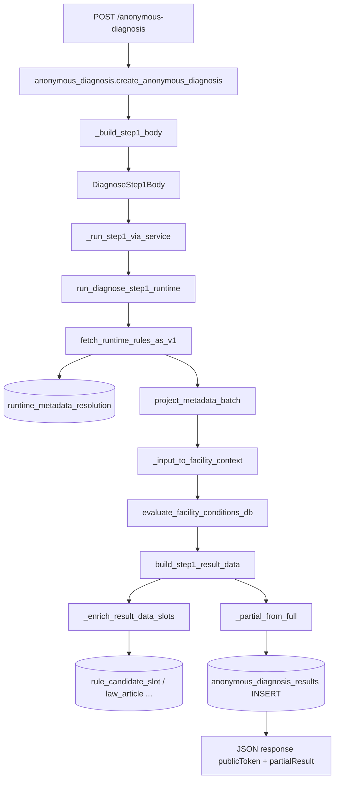

# PIPELINE_TRACE — 법령진단 소비자 파이프라인 (tai-api)

> 기준 커밋: main `cb5af3f` (rollback 후)  
> 분석일: 2026-06-08  
> 작업지시: `docs/WORKORDER_PIPELINE_TRACE.md`

---

## 1. Executive summary

| 항목 | 무료 익명 (`/anonymous-diagnosis`) | 유료 통합 (`/diagnosis/run`) | 등록 API (`legal_engine` / v510) |
|---|---|---|---|
| Step1 함수 | `run_diagnose_step1_runtime` | `run_diagnose_step1_runtime` | `run_diagnose_step1_v510` → `fetch_diagnosis_rules` |
| Rule 소스 | **`runtime_metadata_resolution`** (직접) | 동일 | **env 분기** (runtime / v2 / legacy) |
| `master_building_legal_rules` | **미사용** | **미사용** | env off 시 `legacy_contaminated` |
| `master_rule_v2` | **미사용** | **미사용** | `TAI_USE_V2_ENGINE=true` 시 |
| `_archive/` import | **없음** | **없음** | **없음** |
| 결과 저장 | `anonymous_diagnosis_results` | `anonymous_diagnosis_results` (+ auth/disclaimer 테이블) | 응답만 (경로별 상이) |

**핵심:** 프로덕션 무료·유료 Nexas 소비자 경로는 **환경변수와 무관하게** `runtime_metadata_resolution`만 읽는다.  
`fetch_diagnosis_rules()`의 env 분기는 **v510/legacy API·검증 스크립트** 경로에만 적용.

---

## 2. 파이프라인 다이어그램 (무료 익명 — primary consumer)



---

## 3. 단계별 추적 (무료 익명)

### Step 0 — HTTP 진입

| | |
|---|---|
| **Endpoint** | `POST /anonymous-diagnosis` |
| **File** | `routers/anonymous_diagnosis.py` |
| **Handler** | `create_anonymous_diagnosis(body: AnonymousDiagnosisCreate)` |
| **Registry** | `router_registry/public.py` → `routers.anonymous_diagnosis` |
| **Input** | `{ site_kind, scale, workers, region? }` |
| **Output** | `{ status, publicToken, partialResult, hasFullResult, expiresAt }` |

### Step 1 — 요청 → DiagnoseStep1Body 변환

| | |
|---|---|
| **Function** | `_build_step1_body(body)` |
| **File** | `routers/anonymous_diagnosis.py` |
| **Mapping** | `site_kind` → `sector` (`SECTOR_BY_KIND`) |
| | `scale` → `SCALE_PRESETS` (floor_area, total_floor_area, contract_amount_eok) |
| | `workers` → `worker_count` + `employee_count` (BUILDING/MANUFACTURING) |
| | `workers` → `direct_workers` (CONSTRUCTION) |
| **Output type** | `schemas.legal_engine.DiagnoseStep1Body` |

**sector 매핑**

| site_kind | DiagnoseStep1Body.sector | 표시 정규화 (`_SECTOR_NORMALIZE`) |
|---|---|---|
| construction | CONSTRUCTION | — |
| manufacturing | MANUFACTURING | → INDUSTRIAL (watch/trace용) |
| building | BUILDING | — |
| other | SPECIAL_FACILITY | → BUILDING |

### Step 2 — Step1 엔진 실행

| | |
|---|---|
| **Function** | `_run_step1_via_service` → `run_diagnose_step1_runtime` |
| **File** | `services/diagnosis_runtime_step1.py` |
| **Input** | `DiagnoseStep1Body`, `allowed_sectors` |
| **Sub-steps** | see §4 |

### Step 3 — 결과 축약 + 영속화

| | |
|---|---|
| **Function** | `_partial_from_full(full_result)` |
| **Input** | step1 `result_data` (full) |
| **Output** | `partial_result` (rules_preview ≤12, key_obligations ≤6) |
| **DB** | `anonymous_diagnosis_results` INSERT |
| **Columns** | `public_token`, `input_data`, `partial_result`, `full_result`, `engine_version`, `rule_version`, `expires_at`, `status`, `source_type` |

**저장 메타**

- `engine_version`: `v3.0-runtime-compiler` (`RUNTIME_ENGINE_VERSION`)
- `rule_version`: `runtime_metadata_resolution:v1`

---

## 4. Step1 내부 단계 (`run_diagnose_step1_runtime`)

### 4.1 Rule fetch (소스 확정)

| | |
|---|---|
| **Function** | `fetch_runtime_rules_as_v1` |
| **File** | `services/legal_runtime_fetch.py` |
| **호출 방식** | `run_diagnose_step1_runtime`에서 **직접 호출** (`fetch_diagnosis_rules` 우회) |
| **env 영향** | **없음** (`TAI_USE_RUNTIME_ENGINE` 미참조) |

**DB read chain**

| 순서 | Table | 함수 | 용도 |
|---|---|---|---|
| 1 | `runtime_metadata_resolution` | `fetch_runtime_metadata_rows` | 전체 metadata 페이지네이션 (`*`) |
| 2a | `facility_applicability` | `_factory_rule_candidate_ids` | factory_id 있을 때 draft 서브셋 |
| 2b | `task_candidate` | ↑ | fallback draft |
| 2c | `executable_draft` | ↑ | `rule_candidate_id` |
| 2d | `rule_candidate` | `_metadata_for_factory` | `article_id` |
| 2e | `law_article` | ↑ | law_name + article_no 매칭 |
| 3 | — | `project_metadata_batch` | v1 호환 dict 투영 |
| 4 | — | `filter_runtime_for_sector` | sector 필터 |
| 5 | — | `diagnosis_stage==1` 필터 | stage1만 |

**미사용 (이 경로)**

- `master_building_legal_rules`
- `master_building_legal_rules_legacy_contaminated`
- `master_rule_v2`

### 4.2 Projection

| | |
|---|---|
| **Function** | `project_metadata_to_v1` / `project_metadata_batch` |
| **File** | `services/rule_candidate_projection.py` |
| **Input** | `runtime_metadata_resolution` row |
| **Output** | v1 호환 rule dict (`rule_id` = metadata `id`, `obligation_summary`, flags, `condition_code`/`condition_value`, …) |
| **condition 파생** | `_apply_runtime_condition` — `condition_value` 텍스트에서 `employee_count`/`building_area`/… 추출 |

### 4.3 Facility context

| | |
|---|---|
| **Function** | `_input_to_facility_context(sector_raw, inp)` |
| **File** | `services/legal_context.py` |
| **Input** | `DiagnoseStep1Body` flat fields + `body.input` dict 병합 |
| **Output** | `facility_ctx` (`worker_count`, `total_floor_area`, `construction_amount`, …) |

**필드 병합** (`run_diagnose_step1_runtime` 420–452행): body top-level 필드가 `inp`에 없으면 주입.

### 4.4 Rule matching

| | |
|---|---|
| **Function** | `evaluate_facility_conditions_db(facility_ctx, all_rules, sector_raw)` |
| **File** | `services/legal_rules.py` |
| **Logic** | `condition_code` 없음 → sector/law 휴리스틱 적용 |
| | `condition_code` 있음 → `_db_rule_matches_facility` |
| **매핑** | `CONDITION_CODE_TO_CONTEXT_KEY`: `employee_count` → **`worker_count`** |

### 4.5 Result build

| | |
|---|---|
| **Function** | `build_step1_result_data` |
| **File** | `services/legal_step1_builder.py` |
| **Input** | applicable / not_applicable lists |
| **Helpers** | `_classify_rules_db`, `format_rule_result_db`, `risk_level`, `get_construction_summary` |
| **Article enrich** | `fetch_article_contexts` → `rule_article_mapping`, `law_article` |
| **Output keys** | `rules_table`, `appointment_required`, `inspection_required`, `key_obligations`, `risk_level`, `applicable_count`, `law_badges`, `construction_summary`, … |

### 4.6 Slot enrichment (post-build)

| | |
|---|---|
| **Function** | `_enrich_result_data_slots` → `enrich_rules_with_candidate_slots` |
| **File** | `services/diagnosis_runtime_step1.py` |
| **DB** | `runtime_metadata_resolution` (who/when/how), `law_master`, `law_version`, `law_article`, `rule_candidate`, `rule_candidate_slot` |
| **목적** | rules_table에 `who`/`what`/`when` 주입 |

---

## 5. 유료 통합 경로 (`POST /diagnosis/run`)

| | |
|---|---|
| **Router** | `routers/diagnosis_integrated.py` → `run_diagnosis` |
| **Adapter** | `nexas_run_body_from_request` → `DiagnosisRunBody` → `DiagnoseStep1Body` |
| **Step1** | `_run_step1_via_service` → **`run_diagnose_step1_runtime`** (무료와 동일) |
| **Persist** | `services/diagnosis_integrated_svc.run_diagnosis` → `anonymous_diagnosis_results` |
| **부가 DB** | `diagnosis_auth_log`, `diagnosis_disclaimer_log`, `diagnosis_purchases`, `inicis_auth_requests`, `factories` (binding) |

Rule 소스·matcher·builder: **§4와 동일**.

---

## 6. 대체 경로 (등록 API — 소비자 외 / 레거시)

| Endpoint | Step1 | Rule fetch |
|---|---|---|
| `routers/legal_engine.py` | `run_diagnose_step1_v510` | `fetch_diagnosis_rules` |
| `routers/legal_engine_v510.py` | 동일 | 동일 |
| `services/legal_engine_svc.run_diagnose_step1` | legacy wrapper | `fetch_diagnosis_rules` |

### `fetch_diagnosis_rules` 분기 (`services/legal_diagnosis_rules.py`)

| env | 소스 table | 함수 |
|---|---|---|
| `TAI_USE_RUNTIME_ENGINE=true` | `runtime_metadata_resolution` | `fetch_runtime_rules_as_v1` |
| `TAI_USE_V2_ENGINE=true` | `master_rule_v2` (+ relation/scope tables) | `fetch_rules_v2_as_v1` |
| **default (둘 다 false)** | **`master_building_legal_rules_legacy_contaminated`** | `fetch_rules_v1` |

> 주의: fallback 라벨은 `master_building_legal_rules:v1`이지만 **실제 쿼리 테이블은 `*_legacy_contaminated`**.

**지원 테이블 (v2 경로만):** `master_rule_v2`, `master_rule_v2_relation`, `master_rule_scope_mapping`, `master_rule_scope`, `master_rule_scope_threshold`

---

## 7. 필수 확인 4항

### 7.1 `legacy_contaminated` 참조

| 경로 | 참조 여부 |
|---|---|
| `POST /anonymous-diagnosis` | **없음** |
| `POST /diagnosis/run` | **없음** |
| `fetch_diagnosis_rules` (env default) | **있음** — `master_building_legal_rules_legacy_contaminated` |
| `verification/*` (audit scripts) | **있음** — 검증 전용 |

### 7.2 `_archive/` import

```
grep -r "from _archive\|import _archive" tai-api/**/*.py → 0건 (진단 경로)
```

격리 라우터는 `routers/` 밖 `_archive/routers_20260608/`에만 존재. **진단 파이프라인 import 없음.**

### 7.3 Rule table — 실제 읽는 소스

| Consumer path | 읽는 소스 |
|---|---|
| **무료·유료 Nexas (primary)** | `runtime_metadata_resolution` only |
| v510 API (env runtime) | `runtime_metadata_resolution` |
| v510 API (env v2) | `master_rule_v2` |
| v510 API (env default) | `master_building_legal_rules_legacy_contaminated` |
| `master_building_legal_rules` (비 contaminated) | inspection_sets, law_collector, health probe 등 **타 도메인** — **진단 step1 소비자 경로 아님** |

### 7.4 인터페이스 불일치 (필드명·타입)

| 구간 | 불일치 | 영향 |
|---|---|---|
| API → Step1Body | `workers` → `worker_count` + `employee_count` | 의도적 이중 설정; matcher는 `worker_count` 사용 |
| sector 표준 | 입력 `MANUFACTURING` vs 저장 표시 `INDUSTRIAL` (`_SECTOR_NORMALIZE`) | DB `input_data.sector`는 full_result 기준 |
| sector 표준 | `legal_context`: `INDUSTRIAL` → `MANUFACTURING` 정규화 | 유료 API `INDUSTRIAL` 진입 시 context 정상화 |
| Rule `rule_id` | runtime path: metadata UUID | `rule_article_mapping` 조인 실패 가능 (본문 enrich skip) |
| condition_code | projection: `employee_count` | matcher: `CONDITION_CODE_TO_CONTEXT_KEY` → `worker_count` | **의도적 브릿지** — anonymous는 양쪽 동일값 설정으로 OK |
| condition 누락 | runtime row에 `condition_value` 없으면 `condition_code=""` | `evaluate_facility_conditions_db` class C (무조건 적용) |
| `uploads` vs registry | N/A | 진단 경로 무관 |

**이전 검증에서 확인된 함정 (T-W / T-F01):**  
`worker_count`·`total_floor_area` 입력 변경이 **class C rule (condition 없음) 3394건**에는 영향 없음.  
조건부 rule은 runtime projection의 `employee_count` 1건뿐 — 입력이 `worker_count`로 매핑되면 매칭됨.

---

## 8. DB 테이블 — 진단 소비자 경로 전체

| Table | 단계 | Read/Write |
|---|---|---|
| `runtime_metadata_resolution` | rule fetch, slot fallback | R |
| `facility_applicability` | factory subset | R |
| `task_candidate` | factory subset | R |
| `executable_draft` | factory subset | R |
| `rule_candidate` | factory/article/slot chain | R |
| `law_master` | slot enrich | R |
| `law_version` | slot enrich | R |
| `law_article` | factory narrow / slot enrich / article loader | R |
| `rule_candidate_slot` | slot enrich | R |
| `rule_article_mapping` | article context | R |
| `anonymous_diagnosis_results` | persist | W |
| `diagnosis_auth_log` | 유료 auth | R/W |
| `diagnosis_disclaimer_log` | 유료 disclaimer | R/W |
| `diagnosis_purchases` | 유료 결제 | W |
| `factories` | 유료 company binding | R |

---

## 9. 함수 인덱스 (호출 순)

```
create_anonymous_diagnosis
  └ _build_step1_body
  └ _run_step1_via_service
       └ run_diagnose_step1_runtime          [diagnosis_runtime_step1.py]
            ├ fetch_runtime_rules_as_v1      [legal_runtime_fetch.py]
            │    ├ fetch_runtime_metadata_rows
            │    ├ _metadata_for_factory (optional)
            │    ├ project_metadata_batch    [rule_candidate_projection.py]
            │    └ filter_runtime_for_sector
            ├ normalize_sector_db / get_sector_groups
            ├ _input_to_facility_context     [legal_context.py]
            ├ evaluate_facility_conditions_db [legal_rules.py]
            ├ build_step1_result_data        [legal_step1_builder.py]
            │    └ fetch_article_contexts    [legal_article_loader.py]
            └ _enrich_result_data_slots
                 └ enrich_rules_with_candidate_slots
  └ _partial_from_full
  └ anonymous_diagnosis_results.insert
```

---

## 10. 결론 · 다음 세션 공유 포인트

1. **소비자 파이프라인(무료·유료)은 단일 소스:** `runtime_metadata_resolution` — env 무관, hardcoded runtime path.
2. **`master_building_legal_rules` / `legacy_contaminated` / `master_rule_v2`는 v510·legacy API 분기에서만** — Nexas 소비자와 분리됨.
3. **`_archive/` 격리 코드는 진단 import 없음** — 라우터 격리가 엔진에 영향 없음.
4. **인터페이스 리스크:** `rule_id`(metadata UUID) ↔ `rule_article_mapping` 불일치로 조문 본문 enrich가 частич skip될 수 있음.
5. **등록/폐기 결정은 별도** — 본 문서는 추적만, 변경 없음.

---

## Appendix — 관련 파일

| 역할 | Path |
|---|---|
| 무료 router | `routers/anonymous_diagnosis.py` |
| 유료 router | `routers/diagnosis_integrated.py` |
| Runtime step1 | `services/diagnosis_runtime_step1.py` |
| Rule fetch | `services/legal_runtime_fetch.py` |
| Projection | `services/rule_candidate_projection.py` |
| Env 분기 (비소비자) | `services/legal_diagnosis_rules.py` |
| Context | `services/legal_context.py` |
| Matcher | `services/legal_rules.py` |
| Builder | `services/legal_step1_builder.py` |
| Article loader | `services/legal_article_loader.py` |
| v510 path | `services/legal_v510_svc.py`, `routers/legal_engine.py` |
