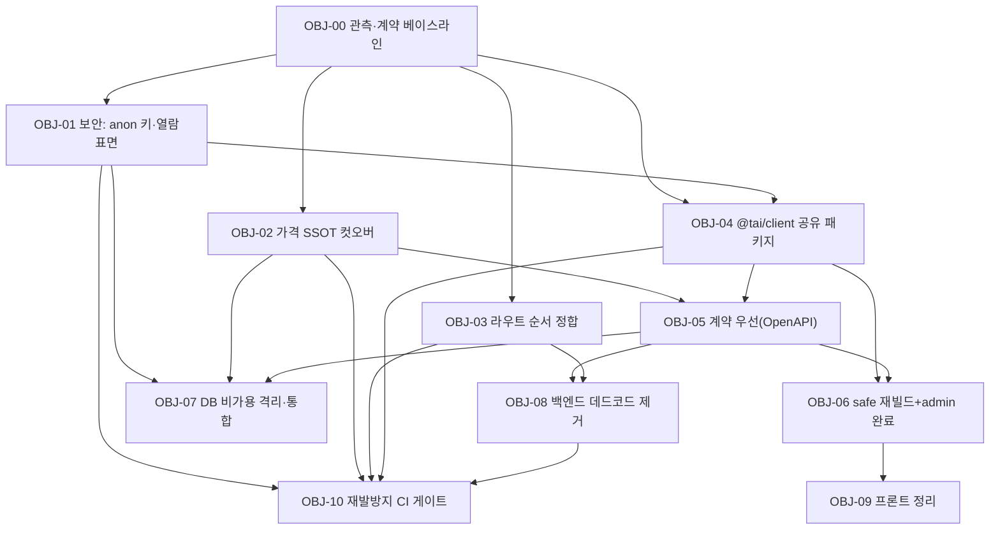

# TAI 리빌딩 작업계획서 — Object 방식

**작성일:** 2026-07-23 · **기준 문서:** [00_아키텍처_심층감사](./00_아키텍처_심층감사_2026-07-23.md)

---

## 1. 왜 Object 방식인가

기존 방식은 "Phase 1 → 2 → 3"처럼 **시간축**으로 묶여, 한 Phase 안에 서로 무관한 작업이 섞이고 한 항목이 막히면 전체가 정체됐다. 리빌딩의 실패 원인이 "**원자적이지 않은 진행**"(DB만 먼저 바꾸고 API·프론트는 뒤처짐)이었으므로, 이번엔 **결과물축(Object)** 으로 관리한다.

- **Object = 독립적으로 검증 가능한 산출물 단위.** 각 Object는 `범위 / 작업목표(=완료 정의) / 선행의존 / 산출물 / 완료 테스트(게이트) / 롤백`을 가진다.
- **게이트 규칙:** Object의 **완료 테스트가 모두 통과해야** 그 Object에 의존하는 다음 Object를 착수한다. 통과 못 하면 그 Object 안에서 머문다(다음으로 넘어가지 않음).
- **병렬 허용:** 의존이 없는 Object는 동시에 진행 가능. 순서는 시간이 아니라 **의존성 그래프**가 강제한다.
- **원자성:** 한 Object가 여러 계층(DB+API+FE)에 걸치면, 그 Object의 게이트는 **세 계층을 함께** 통과해야 완료로 본다. 임시 호환 뷰 등 반창고는 반드시 "제거 Object"로 연결해 추적한다.

### Object 카드 표준 형식
```
OBJ-XX  이름
- 범위(In/Out): 포함/제외 명시
- 작업목표(완료 정의): 무엇이 되면 끝인가
- 선행의존: 통과해야 착수 가능한 Object
- 산출물: 코드/DB/문서 결과물
- 완료 테스트(게이트): 통과 조건(자동/수동), 이게 green이어야 다음 진행
- 롤백: 실패 시 되돌리는 법
- 상태: 대기 / 진행 / 게이트대기 / 완료
```

---

## 2. 의존성·연결성 (그래프)



### 병렬 트랙 (게이트가 순서를 강제)
- **트랙 S (보안·데이터):** OBJ-00 → OBJ-01 → OBJ-07
- **트랙 B (백엔드 정합):** OBJ-00 → OBJ-02 → OBJ-05 → OBJ-08 · (OBJ-03은 OBJ-00 후 병렬, OBJ-08로 합류)
- **트랙 F (프론트 통합):** OBJ-00 → OBJ-04 → OBJ-06 → OBJ-09
- **수렴:** OBJ-05·OBJ-06·OBJ-08 완료 후 → **OBJ-10**(재발방지 게이트)이 마지막에 규칙을 못박음
- **연결성 핵심:** OBJ-04(공유 클라이언트)는 OBJ-01(키 회전 결과)을 반영해야 하고, OBJ-06(재빌드)은 OBJ-04·OBJ-05가 선행. OBJ-07(DB 격리)은 OBJ-02·OBJ-05로 참조가 확정된 뒤라야 안전.

---

## 3. Object 카드

### OBJ-00 · 관측·계약 베이스라인
- **범위(In):** 3사이트 핵심 경로 스모크 테스트 세트, `tai-api` OpenAPI 스냅샷 덤프, DB 스키마·grant·정책 스냅샷. (Out) 기능 변경.
- **작업목표:** 이후 모든 Object의 **회귀 판정 기준선** 확보.
- **선행의존:** 없음.
- **산출물:** `docs/tai-rebuild/baseline/` (openapi.json, db_schema.sql, smoke_checklist.md).
- **완료 테스트(게이트):** 3사이트 핵심 경로(로그인·목록·가격·문의) 스모크 all green + 스냅샷 3종 저장 완료.
- **롤백:** 해당 없음(읽기 전용).

### OBJ-01 · 보안: anon 키 회전 + 열람 표면 최소화
- **범위(In):** 공개 필요 테이블 화이트리스트 확정, 정책/GRANT 불일치 264 정합, 나머지 anon REVOKE, anon 키 회전. (Out) 스키마 구조 변경.
- **작업목표:** 공개 anon 키로 접근 가능한 테이블을 **의도된 공개분만**(현 338 → 최소).
- **선행의존:** OBJ-00.
- **산출물:** `sql/2026xxxx_anon_surface_lockdown.sql`(idempotent), 공개 테이블 화이트리스트 문서, 회전된 키 반영 PR.
- **완료 테스트(게이트):** (a) 공개사이트/safe의 필수 read/write 정상, (b) 화이트리스트 외 테이블 anon 접근 403/42501 확인 스크립트 green, (c) 전 사이트 스모크 무회귀.
- **롤백:** REVOKE/GRANT는 대칭 SQL로 원복, 구 키 일시 병행 허용 후 폐기.

### OBJ-02 · 가격 SSOT 컷오버 마감
- **범위(In):** `price_setting.py`·`admin_pricing.py`·`pricing_validation_api.py`를 `price_master` 기준으로 재배선 또는 은퇴, 잘못된 SSOT docstring 수정, 편집(PATCH) 경로 정상화, 임시 호환 뷰 제거. (Out) 신규 가격정책.
- **작업목표:** **가격 도메인 SSOT = price_master 1개**, 유령 테이블 참조 0.
- **선행의존:** OBJ-00.
- **산출물:** 라우터 PR, 호환 뷰 제거 마이그레이션, 계약 갱신.
- **완료 테스트(게이트):** price-setting 전 탭(SaaS/진단/수선/안전/컨설팅/수수료) **조회 200 + 편집 저장 성공**, 공개 pricing과 값 일치, 호환 뷰 제거 후 무회귀 스모크 green.
- **롤백:** 라우터 revert + 호환 뷰 재생성(이미 검증됨).

### OBJ-03 · 라우트 순서 정합 + 린트
- **범위(In):** 전 라우터의 단일 세그먼트 `/{id}` 캐치올을 형제 라우트 뒤로, 순서 린트 추가. (Out) 엔드포인트 신설.
- **작업목표:** 라우트 섀도잉(`/summary`·`/overview` 등) 제거.
- **선행의존:** OBJ-00.
- **산출물:** 라우터 정렬 PR, `tests/test_route_order.py`(또는 CI 린트).
- **완료 테스트(게이트):** 각 라우터 형제 라우트 200 + 순서 린트 CI green.
- **롤백:** 라우터 순서 revert.

### OBJ-04 · @tai/client 공유 패키지 (전역 복붙 제거)
- **범위(In):** `config + apiCall + sbFetch + session 계약`을 단일 버전드 패키지로, 시크릿 env화, admin 2번째 키 제거, 3사이트가 이 패키지 소비. (Out) 화면 로직.
- **작업목표:** 사이트 간 **복사된 전역 근절**(단일 출처).
- **선행의존:** OBJ-00, OBJ-01(회전된 키·화이트리스트 반영).
- **산출물:** `@tai/client` 패키지 + 각 사이트 어댑터 PR, `.env` 스키마.
- **완료 테스트(게이트):** 3사이트가 공유 패키지로 동작(스모크) + **소스 내 하드코딩 시크릿 grep 결과 0** + 전역 `window.*` 데이터접근 잔재 0.
- **롤백:** 사이트별 어댑터 단위로 부분 롤백 가능(패키지 버전 핀).

### OBJ-05 · 계약 우선(OpenAPI) 경계
- **범위(In):** API 계약 확정·게시, 프론트가 계약(생성 타입) 소비, 뷰=내부 read-model 규정. (Out) 신규 도메인.
- **작업목표:** 계층 경계를 **DB 테이블 모양이 아니라 계약**으로 고정.
- **선행의존:** OBJ-02(SSOT 확정), OBJ-04(client).
- **산출물:** 게시된 OpenAPI + 프론트 타입 생성 파이프라인 + 계약 diff CI.
- **완료 테스트(게이트):** 계약 스냅샷 대비 **breaking change 검출 CI** 동작 확인, 프론트 타입생성 빌드 green, 프론트에서 DB 테이블명 직접참조 0.
- **롤백:** 계약 버전 태그로 이전 계약 복귀.

### OBJ-06 · safe(tadmin) 재빌드 + admin 잔여 완료 → 구 admin 은퇴
- **범위(In):** tadmin/safe를 공유 client 기반 Vue3로 재빌드, admin 잔여 ~10p 이관, 패리티 확인 후 `admin/full-version` 은퇴. (Out) 신규 기능.
- **작업목표:** 반쪽 마이그레이션 종결(레거시 프론트 제거).
- **선행의존:** OBJ-04, OBJ-05.
- **산출물:** safe 신규 앱 + admin 잔여 PR + 은퇴 절차 문서.
- **완료 테스트(게이트):** safe/admin **패리티 스모크 통과**, 구 도메인(admin-old 등) 트래픽 0 확인 후 은퇴.
- **롤백:** 도메인 스위치 원복(구 배포 유지 기간 확보).

### OBJ-07 · DB 비가용 자산 격리·통합
- **범위(In):** 0행/미참조 382개 분류 → archive 격리, 규칙 2세대(`master_legal_rules_*`→`master_rule_v2`) 통합, 초안(candidate/residual) 정리. (Out) 활성 데이터 삭제(물리 삭제 금지).
- **작업목표:** DB 표면 축소·중복 세대 제거.
- **선행의존:** OBJ-02, OBJ-05(참조가 계약으로 확정된 뒤).
- **산출물:** 분류표 + `sql/2026xxxx_archive_*.sql`(SET SCHEMA archive) + 복구 절차.
- **완료 테스트(게이트):** 격리 대상별 코드/뷰/함수/FK 참조 0 재확인 + 격리 후 전 사이트 스모크 무회귀.
- **롤백:** `ALTER TABLE archive.<t> SET SCHEMA public;` (팀 표준, 검증됨).

### OBJ-08 · 백엔드 데드코드 제거
- **범위(In):** `_archive/routers_20260608`·`*.bak`·구 `legal_*_v*` 서비스·미등록 유령 라우터 제거, `router_registry`를 단일 매니페스트로 보증. (Out) 활성 라우터 변경.
- **작업목표:** 코드 표면 축소, "등록=존재" 불변식 확립.
- **선행의존:** OBJ-05(계약), OBJ-03(라우트 정합).
- **산출물:** 삭제 PR + `router_registry` 검사 스크립트.
- **완료 테스트(게이트):** 부팅/`/health` green + **routers/ 파일 = 등록 라우터 일치 검사** 통과 + 스모크 무회귀.
- **롤백:** git revert(삭제 커밋 단위).

### OBJ-09 · 프론트 정리
- **범위(In):** 중복 `full-version` 트리·잔존 폴더·벤더 라이브러리·이중 프록시 워커·편집 아티팩트 제거. (Out) 활성 페이지.
- **작업목표:** 프론트 표면·번들 축소, 단일 진실 소스.
- **선행의존:** OBJ-06(재빌드 완료 후 구 트리 제거).
- **산출물:** 삭제 PR.
- **완료 테스트(게이트):** 3사이트 빌드·스모크 green + 죽은 링크 검사 통과.
- **롤백:** git revert.

### OBJ-10 · 재발방지 CI 게이트
- **범위(In):** (a) 미등록 라우터, (b) 정책≠GRANT 테이블, (c) 프론트의 DB 테이블 직접참조, (d) 소스 내 하드코딩 시크릿 → **빌드 실패**. (Out) 런타임 기능.
- **작업목표:** 결합·비가용·SSOT 붕괴의 **구조적 재발 차단**.
- **선행의존:** OBJ-01, OBJ-02, OBJ-03, OBJ-04, OBJ-08(게이트가 검사할 규칙이 확립된 뒤).
- **산출물:** CI 워크플로 + 검사 스크립트 4종.
- **완료 테스트(게이트):** 의도적 위반 PR을 **실제로 차단**하는지 데모 통과.
- **롤백:** 게이트 비활성화 플래그(경고 모드로 강등).

---

## 4. 상태 보드

| Object | 트랙 | 선행의존 | 상태 |
|---|---|---|---|
| OBJ-00 베이스라인 | 공통 | — | 대기 |
| OBJ-01 보안 | S | 00 | 대기 |
| OBJ-02 가격 SSOT | B | 00 | 대기 |
| OBJ-03 라우트 순서 | B | 00 | 대기 |
| OBJ-04 @tai/client | F | 00,01 | 대기 |
| OBJ-05 계약 우선 | B | 02,04 | 대기 |
| OBJ-06 재빌드 마감 | F | 04,05 | 대기 |
| OBJ-07 DB 격리 | S | 02,05 | 대기 |
| OBJ-08 백엔드 데드코드 | B | 05,03 | 대기 |
| OBJ-09 프론트 정리 | F | 06 | 대기 |
| OBJ-10 CI 게이트 | 수렴 | 01,02,03,04,08 | 대기 |

> 진행 시 각 Object 상태를 `대기 → 진행 → 게이트대기 → 완료`로 갱신하고, 게이트 통과 근거(테스트 로그/스크린샷)를 이 폴더에 함께 남긴다.

---

## 5. 착수 순서 권고 (게이트 기준, 시간 아님)
1. **OBJ-00** 먼저(기준선) → 이후 **OBJ-01 / OBJ-02 / OBJ-03 동시 착수 가능**.
2. OBJ-01 게이트 통과 → **OBJ-04** 착수. OBJ-02 게이트 통과 → **OBJ-05** 착수.
3. OBJ-04·05 통과 → **OBJ-06**; OBJ-02·05 통과 → **OBJ-07**; OBJ-03·05 통과 → **OBJ-08**.
4. OBJ-06 통과 → **OBJ-09**. 규칙 확립분 통과 → **OBJ-10**으로 못박음.
