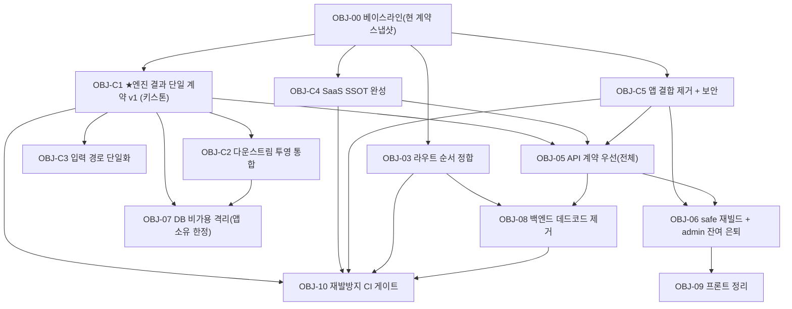

# TAI 리빌딩 작업계획서 — Object 방식 (v2)

**개정:** 2026-07-23 (v2) · **기준:** [00 감사](./00_아키텍처_심층감사_2026-07-23.md) · [02 보정](./02_실코드_정밀분석_보정_2026-07-23.md) · [04 종합결론](./04_종합결론_전체소비로직_2026-07-23.md) · [05 추가조사 종결](./05_추가조사_종결_2026-07-23.md)

> **v2 변경 요지:** 심층 실측 결과, 작업 무게중심이 "청소"가 아니라 **"엔진 결과 단일 계약 정립(C1)"** 으로 이동. 엔진 경계는 HTTP가 아니라 **DB 계약(테이블+Postgres 함수)**, 실제 제품 볼륨은 **공개/익명 진단 트랙**(anonymous_diagnosis_results 3,409행 vs 인증 FDR 2행)임을 반영.

---

## 1. Object 방식 원칙 (불변)
- **Object = 독립 검증 가능한 산출물 단위.** 구성: `범위(In/Out) / 작업목표(완료 정의) / 선행의존 / 산출물 / 완료 테스트(게이트) / 롤백`.
- **게이트 규칙:** Object의 완료 테스트가 모두 green이어야 의존 Object 착수. Phase(시간축) 아님 — **의존성 그래프가 순서를 강제**.
- **원자성:** 여러 계층(DB+API+FE)에 걸친 Object는 세 계층이 함께 게이트를 통과해야 완료. 임시 호환 뷰 등 반창고는 "제거 Object"로 추적.
- **엔진 경계:** 체크·법령엔진(외부 범용엔진)은 **블랙박스**. 엔진 소유 = 테이블 계열(semantic_clause 등) **+ Postgres 함수(diagnose_clauses_common 등)**. 앱 Object는 엔진 내부를 건드리지 않고 **계약 버전으로만** 접속.

---

## 2. 의존성·연결성 (v2)

**병렬 트랙**
- **트랙 K(키스톤):** O0 → **C1** → C2 · C3 (엔진 경계·계약)
- **트랙 A(앱):** O0 → C4(SaaS SSOT) · C5(결합·보안) → O5 → O6 → O9
- **트랙 S(구조):** O0 → O3 → O8 ; C1·C2 → O7
- **수렴:** C1·C4·C5·O3·O8 → **O10**

---

## 3. Object 카드

### OBJ-00 · 관측·계약 베이스라인
- **범위:** 3사이트 핵심경로 스모크 + **현행 파편 계약 스냅샷**(FDR `result_data` 키·`anonymous_diagnosis_results.full_result`·`quotes.legal_result_json`·`/legal-engine/result`·`/diagnosis/result/{token}` 응답 실측) + DB 스키마/함수 목록.
- **목표:** 회귀 기준선 + "현재 계약이 몇 갈래인지" 문서화.
- **선행:** 없음. **게이트:** 스모크 green + 스냅샷 저장(응답 5종·result_data 키 실측 포함).

### OBJ-C1 · ★엔진 결과 단일 계약 v1 (키스톤)
- **범위(In):** 엔진 산출(DB: `full_result`/`obligations`/`obligation_instance`) 를 **버전드 단일 result 계약**으로 정의·문서화. **공개 트랙 `full_result`(3,409행)를 기준 스키마**로 삼고 FDR/`legal_result_json`을 수렴. `diagnosis_transform`을 "키 추측 → **스키마 검증**"으로 전환. 프론트의 엔진 코드→라벨 맵(`CYCLE_MAP`·`RULE_TYPE_KO`·`QUAL_MAP`)을 **백엔드 계약으로 이관**. (Out) 엔진 내부 로직.
- **목표:** 엔진↔TAI가 **하나의 버전드 계약**으로만 연결(현재 저장4·읽기4 → 1계약+어댑터).
- **선행:** OBJ-00 + **엔진팀 합의**(계약은 DB 산출 형태이므로 엔진팀과 공동 소유).
- **산출물:** `result_contract_v1`(JSON schema + 버전), 검증형 transform, 프론트 라벨맵 백엔드화.
- **게이트:** (a) 공개·admin·step1 세 화면이 **동일 계약**으로 렌더, (b) 계약 위반 응답을 transform이 **거부/로그**(추측 폴백 제거), (c) 스냅샷 대비 무회귀.
- **롤백:** 계약 v1을 어댑터로 감싸 구 형태 병행(버전 핀).

### OBJ-C2 · 다운스트림 투영 통합
- **범위:** 일정(`work_schedules` 2 writer·`runtime_schedule`·`work_assignments`)·문서·런타임의 **4중 status 어휘·중복 테이블을 단일 상태기계**로. 라이브 경로 `runtime_candidate→runtime_task`(339) 기준. `create_task`가 status를 candidate로 강제하는 버그 수정.
- **엔진 소유 제외:** `runtime_obligation_registry`(앱 read-only ghost)·`runtime_operational_work_order`(엔진 update-only)는 **엔진 워크스트림 소관** — 앱은 상태전이 계약만.
- **선행:** C1. **게이트:** 의무 1건이 일정/문서/런타임에 **일관 status**로 투영되는 E2E 테스트 green, ghost 경로 정리 확인.

### OBJ-C3 · 입력 경로 단일화
- **범위:** `facility_profiles` 이중 write(`facility_profile_api` vs `exists_input_service`가 `factories` UPDATE) **정책 모순 제거**, 입력 감사 사각(`exists_inputs/worker_count`) 보강, scope 미구현(`PROCESS/EQUIP/ACTIVITY` 영구 UNKNOWN) 처리. 엔진 투입(=DB 산출 트리거)을 **계약화**.
- **선행:** C1(입력↔결과 계약 정합). **게이트:** 입력 라운드트립·감사(sc01~03) 통과 + 단일 write 경로 확인.

### OBJ-C4 · SaaS SSOT 완성
- **범위:** 가격(price_master 정본, 병렬 5+ 수렴, `pricing_validation_api` SSOT 모순·`admin_pricing`의 `_cache` 침범 제거), 커미션(SSOT 신설: price_commission/connection_commission/repair_brokerage/experts.fee 통합), 교육(`education_history` vs `education_assignment` 이원화·중복 엔드포인트), 알림(레거시 `notifications` vs runtime 엔진), 수선/ fix(공급자 레지스트리 2개) 정리.
- **선행:** OBJ-00. **게이트:** 각 도메인 SSOT 단일화 후 화면·계산 무회귀, 병렬 저장소 read 0.

### OBJ-C5 · 앱 결합 제거 + 보안
- **범위:** `@tai/client` 공유 패키지(config+apiCall+sbFetch+session)로 3사이트 복붙 전역 제거, 시크릿 env화(admin 2번째 키 제거·anon 키 회전), **`/login` dev_otp 제거**, anon 열람표면 축소(**백엔드는 service_role로 RLS 우회 → 이 이슈는 프론트 직결 조회 한정**).
- **선행:** OBJ-00. **게이트:** 3사이트 공유 패키지 동작 + 소스 내 하드코딩 시크릿 0 + dev_otp 부재 + anon 접근 화이트리스트 외 차단.

### OBJ-03 · 라우트 순서 정합
- **범위:** 단일 세그먼트 `/{id}` 캐치올 후순위화 + CI 린트. **선행:** OBJ-00. **게이트:** 형제 라우트 200 + 린트 green.

### OBJ-05 · API 계약 우선(전체)
- **범위:** C1(진단 계약)을 넘어 전체 OpenAPI 계약화·게시, 프론트 타입 생성, breaking-change diff CI. **선행:** C1·C4·C5. **게이트:** 계약 diff CI 동작 + 프론트 타입빌드 green.

### OBJ-06 · safe 재빌드 + admin 잔여 완료 → 구 admin 은퇴
- **범위:** safe(tadmin) Vue3 재빌드(공유 client·계약 소비), admin 잔여 ~10p, `admin/full-version` 은퇴. **우선순위 참고:** 공개 진단 트랙이 제품 핵심. **선행:** C5·O5. **게이트:** 패리티 스모크 + 구 도메인 트래픽 0.

### OBJ-07 · DB 비가용 격리 (앱 소유 한정)
- **범위:** 앱 소유 테이블만 분류→archive. **엔진 소유(semantic_clause 등 테이블 계열 + `diagnose_clauses_common` 등 함수군) 제외.** "0행" 단독 판정 금지(3중 확인). **선행:** C1·C2. **게이트:** 참조 0 재확인 + 무회귀.

### OBJ-08 · 백엔드 데드코드 제거
- **범위:** 미등록 고아 라우터 ~35(예: `legal_engine_v510`·`documents`·`buildings`…) 제거, `router_registry` 단일 매니페스트 보증. **유지:** `legacy_freeze`(능동 410 가드), 런타임 라이브 경로. **선행:** O3·O5. **게이트:** 부팅/health green + 등록=파일 일치 검사.

### OBJ-09 · 프론트 정리
- **범위:** 중복 full-version 트리·벤더·이중 프록시 제거. **선행:** O6. **게이트:** 3사이트 빌드/스모크 green.

### OBJ-10 · 재발방지 CI 게이트
- **범위:** (a)미등록 라우터 (b)정책≠GRANT(anon 표면) (c)프론트 DB 테이블 직접참조 (d)하드코딩 시크릿 (e)**엔진 결과 계약 breaking-change** → 빌드 실패. **선행:** C1·C4·C5·O3·O8. **게이트:** 의도적 위반 PR 차단 데모.

---

## 4. 상태 보드
| Object | 트랙 | 선행 | 상태 |
|---|---|---|---|
| OBJ-00 베이스라인 | 공통 | — | 대기 |
| OBJ-C1 ★엔진 결과 단일계약 | K | 00+엔진팀 | 대기 |
| OBJ-C2 다운스트림 투영 통합 | K | C1 | 대기 |
| OBJ-C3 입력 경로 단일화 | K | C1 | 대기 |
| OBJ-C4 SaaS SSOT 완성 | A | 00 | 대기 |
| OBJ-C5 앱 결합·보안 | A | 00 | 대기 |
| OBJ-03 라우트 순서 | S | 00 | 대기 |
| OBJ-05 API 계약 우선 | A | C1·C4·C5 | 대기 |
| OBJ-06 재빌드 은퇴 | A | C5·O5 | 대기 |
| OBJ-07 DB 격리(앱 한정) | S | C1·C2 | 대기 |
| OBJ-08 백엔드 데드코드 | S | O3·O5 | 대기 |
| OBJ-09 프론트 정리 | A | O6 | 대기 |
| OBJ-10 CI 게이트 | 수렴 | C1·C4·C5·O3·O8 | 대기 |

## 5. 착수 순서 권고 (게이트 기준)
1. **OBJ-00** → 이후 **C1(키스톤)** 최우선 + **C4·C5·O3 병렬** 가능.
2. **C1 게이트 통과 → C2·C3·O7** 착수. C4·C5 통과 → **O5**.
3. **O5 통과 → O6**; O3·O5 → O8. **O6 → O9.** 규칙 확립분 → **O10**으로 못박음.

> 별도 워크스트림(앱 밖): **엔진(체크·법령 범용엔진 45cminc/*)** — semantic_clause·diagnose_clauses_common 등 엔진 소유 자산의 구조/정리/세대통합. 앱과는 **C1 계약 버전**으로만 접속.
