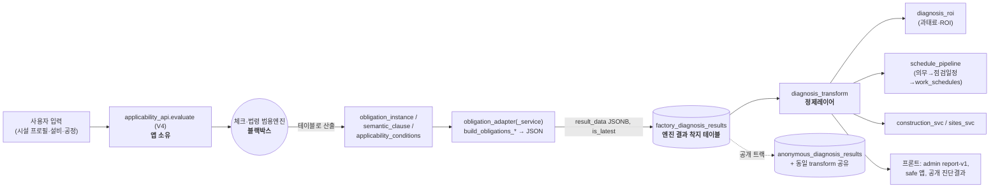

# 엔진 I/O 이음새 + TAI 소비 로직 지도 (엔진 내부 제외)

**작성일:** 2026-07-23 · **범위:** 체크·법령엔진(외부 범용엔진)은 **블랙박스**로 두고, 그 **앞(입력 투입)·이음새(계약)·뒤(JSON 소비)** 의 TAI 로직만 실코드로 추적.
**근거:** `routers/obligation_adapter.py`, `routers/diagnosis_transform.py` 전문 + `factory_diagnosis_results` 참조처 코드검색.

---

## 1. 확정된 실제 흐름 (사용자 입력 → 엔진 → JSON → TAI 사용)

**핵심 착지점 = `factory_diagnosis_results.result_data`(JSONB).** 엔진이 만든 obligations/verdict가 여기 저장되고, 이후 모든 TAI 소비가 여기서 출발한다. 로그인 트랙(`factory_diagnosis_results`)과 공개 익명 트랙(`anonymous_diagnosis_results`)이 **같은 정제 코드(diagnosis_transform 함수)를 공유**한다.

---

## 2. 소비처 실측 (엔진 내부 제외)

| 파일 | 역할(Z) | 비고 |
|---|---|---|
| `routers/obligation_adapter.py` | 이음새(쓰기) | V4/trigger/from-instances 3경로가 factory_diagnosis_results 저장 |
| `services/obligation_adapter_service.py` | 이음새(JSON 빌드) | build_obligations_from_v4 / _trigger_candidates / build_result_data |
| `routers/diagnosis_transform.py` | **정제레이어(핵심)** | result_data → 표준 응답(headline/obligations/warnings/roi/schedule/next_actions) |
| `routers/diagnosis_roi.py` | 소비 | 과태료·ROI 대시보드 |
| `routers/schedule_pipeline.py` | 소비 | 의무 → 점검 일정 → work_schedules/runtime |
| `services/construction_svc.py`, `construction_sites_svc.py` | 소비 | 건설 도메인 특화 |
| `app/models/diagnosis_result.py` | 모델 | |
| `scripts/migrate_result_data_v2026_04.py` | 마이그레이션 | **result_data 스키마 버전 이동 = 스키마 churn 증거** |

*(코드검색은 상한이 있어 목록이 완전하지 않을 수 있음 — 프론트 소비는 admin `report-v1`, safe 앱, 공개 진단결과 페이지)*

---

## 3. 구조 문제 (실코드 근거)

**P1 — 엔진→TAI JSON 계약이 사실상 없음 (가장 큰 문제).**
`diagnosis_transform`은 `result_data`의 키를 **계속 추측**한다: headline은 `headline→headline_message→summary.headline→자동생성`, obligations는 `obligations/key_obligations/mandatory_obligations/critical_obligations→{cat}_items→문자열/래퍼`까지 전부 대응, schedule은 `inspection_schedule/_ready/_summary`. `migrate_result_data_v2026_04.py`·`schema_version` 존재가 스키마 드리프트를 방증. → **엔진이 JSON 형태를 바꾸면 폴백이 조용히 열화**(예: 진짜 headline 대신 "총 N개 법령 의무…" 자동문구). 이것이 엔진 경계의 "한 곳 고치면 깨짐".

**P2 — 비즈니스 로직이 정제레이어에 흩어져 있음.**
과태료 추정(`rule_count×3,000,000`), ROI/손익분기, 심각도 임계값(`rc≥30→CRITICAL`), 카테고리 매핑이 `diagnosis_transform`에 내장(그리고 `diagnosis_roi`와 중복 가능). 엔진 산출이 아니라 **TAI 비즈니스 규칙**인데 폴백 코드 안에 섞여 있음.

**P3 — 두 트랙이 소비 코드를 공유하나 테이블이 다름.**
`anonymous_diagnosis.py`가 transform 헬퍼(`_extract_headline/_exposure/_inspection_schedule`)를 import. `factory_diagnosis_results`(인증) vs `anonymous_diagnosis_results`(공개) → transform 한 줄 바꾸면 **양쪽 동시 영향**.

**P4 — 이음새 어댑터가 3경로 병존.**
`obligation_adapter`의 V4→obligations / run-trigger / from-instances 세 경로가 각기 다른 `source` 태그로 같은 테이블에 저장 → 누적된 중복 경로, 정합 필요.

**P5 — 엔진↔앱 핸드오프 테이블의 소유권 모호.**
`obligation_instance`·`semantic_clause`·`applicability_conditions`(엔진 쓰기) → `factory_diagnosis_results`(앱 출력 저장). 어디까지 엔진 소유이고 어디부터 앱 소유인지 **계약으로 명문화 안 됨**.

---

## 4. 계획(01) 반영 — 신규/보정 Object

- **OBJ-C1 (엔진 JSON 계약 고정, 신규·최우선):** `result_data`의 **버전드 스키마 계약**을 정의·문서화하고, 정제레이어를 "추측"에서 "검증(schema validate)"으로 전환. 엔진팀과 **계약 버전**으로만 연결(엔진 내부 불문).
- **OBJ-C2 (소비 비즈니스로직 단일화, 신규):** 과태료·ROI·심각도·카테고리 규칙을 `diagnosis_transform`/`diagnosis_roi`에서 **단일 presentation/business 모듈**로 추출(중복 제거, 테스트 가능화).
- **OBJ-C3 (이음새 어댑터 정합, 신규):** obligation_adapter 3경로를 하나로 수렴하거나 명확히 분리(공개/인증/시스템), `source` 계약화.
- **OBJ-C4 (핸드오프 테이블 소유권 명문화):** obligation_instance/semantic_clause/applicability_conditions=엔진 쓰기, factory_diagnosis_results=앱 출력. 소유·읽기/쓰기 방향을 계약표로 고정 → OBJ-07(DB정리)·엔진 워크스트림 경계 확정.
- 이 4개는 앞 01 계획의 OBJ-05(계약 우선)·OBJ-07(DB)와 연결되며, **엔진 워크스트림과 계약 버전으로만 접속**한다.

---

## 5. 정직한 범위 한계
- 본 지도는 **진단/의무 흐름(엔진 I/O의 중심)** 을 실코드로 깊게 추적했다. 이 흐름이 사용자님이 지목한 "입력→엔진→JSON→TAI 사용"의 본체다.
- **Z4(엔진과 무관한 순수 SaaS 도메인: 결제·매칭·교육·설비·계약·문의)** 는 표준 CRUD 성격으로 위험도가 낮아 이번 지도에서 제외했다 — 필요 시 도메인별 별도 추적.
- 아직 라인 단위로 안 본 것: `schedule_pipeline`·`document_engine`·`runtime_bridge`의 **의무→일정/문서/런타임 투영 상세 로직**(다음 확장 대상). 프론트(admin report-v1·safe·공개결과)의 **응답 소비 방식**.
